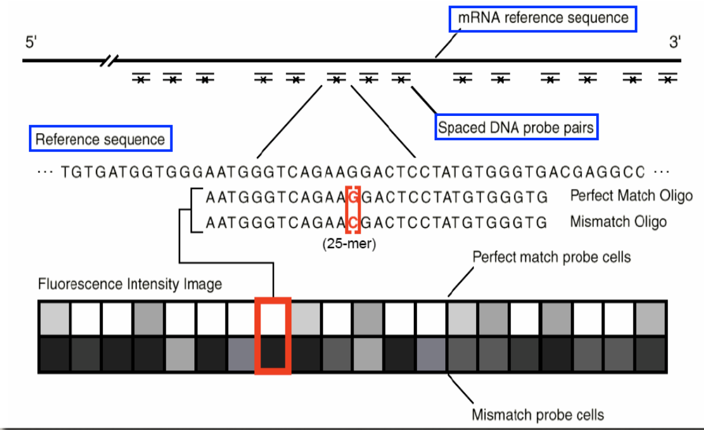

# Technology overview

Affymetrix microarrays are a popular commercial platform available for a wide range of
genomics applications (gene expression profiling, SNP genotyping, ChIP-chip analysis etc.)
in different species.
The main distinction between Affymetrix and other array technologies is the use of many
short (25mer) probes to measure hybridisation.
In this practical, we explore the basic analysis issues for Affymetrix GeneChips which measure gene expression using multiple (11-20) perfect match (PM) and mismatch (MM) probes
concentrated in the 3’ region of each transcript. 



Despite our focus on expression arrays, many
of the processing steps, such as quality assessment and normalisation are equally important
for other applications of Affymetrix technology to ensure that the signal is comparable between arrays.
In this practical we use several Bioconductor packages ([affy](http://bioconductor.org/packages/release/bioc/html/affy.html), [affyPLM](http://bioconductor.org/packages/release/bioc/html/affyPLM.html), [limma](http://bioconductor.org/packages/release/bioc/html/limma.html), etc.) to read in
the raw data, assess data quality and normalise an Affymetrix experiment. Raw data for Affymetrix arrays are usually stored in [`.cel`](http://dept.stat.lsa.umich.edu/~kshedden/Courses/Stat545/Notes/AffxFileFormats/cel.html) format. We wouldn't normally wish to view these files directly. These files contain the intensities of each "cell" on chip surface after image analysis. 

  - Each hybridisation has a unique *cel* file
  - It is know in advance which probe / probe set is located within each cell
  - Each chip type (e.g.hgu95av2) has a *cdf* (chip description) file which is required to decode which probe and probe set is within each cell.

# Example analysis in R

## The estrogen dataset

The experiment we will analyse is made-up of eight Affymetrix *HGU95Av2*
GeneChips. The aim of the experiment is briefly described below (excerpt taken from the
factDesign package vignette).

> “The investigators in this experiment were interested in the effect of estrogen on the genes in ER+ breast cancer cells over time. After serum starvation of all eight samples, they exposed
four samples to estrogen, and then measured mRNA transcript abundance after 10 hours for
two samples and 48 hours for the other two. They left the remaining four samples untreated,
and measured mRNA transcript abundance at 10 hours for two samples, and 48 hours for
the other two. Since there are two factors in this experiment (estrogen and time), each at
two levels (present or absent, 10 hours or 48 hours), this experiment is said to have a 2 × 2
factorial design.”

The data for this section are described the [estrogen data package](http://www.bioconductor.org/packages/release/data/experiment/html/estrogen.html)

```{r echo=FALSE,cache=TRUE,include=FALSE}
datadir <- system.file("extdata", package="estrogen")
dir.create("estrogen")
sapply(list.files(datadir), function(x) file.copy(paste(datadir,x,sep="/"),"estrogen"))
```


The cel files for the example experiement are stored in the `estrogen` directory

The first stage is to read the *targets* file. In Bioconductor we often use a targets file to define the files corresponding to the raw data for the experiment and which sample groups they belong to. Such a file can be created in a spreadsheet, or text editor, and usually saved as a tab-delimited file. We can have as many columns in the file as we see fit, and one row for each hybridisation. The sample group information is propogated through the analysis and incorporated in the quality assessment and eventually differential expression. We refer to this as the "phenotype data" for the experiment, or sometimes the *"metadata"*.

```{r message=FALSE}
library(affy)
targetsFile <- "estrogen/estrogen.txt"
pd <- read.AnnotatedDataFrame(targetsFile,header=TRUE,sep="",row.names=1)
pData(pd)
```

As cel files are not a typical file format, we cannot use the standard R functions such as `read.delim`, `read.csv` and `read.table`. The function to import the data is `ReadAffy` from the [affy](http://bioconductor.org/packages/release/bioc/html/affy.html) package. 

```{r,message=FALSE,warning=FALSE}

raw <-ReadAffy(celfile.path = "estrogen", filenames=rownames(pData(pd)),phenoData = pd)
raw
```

1) What type of Affy array is this
2) How many features?
3) How many samples?


## Diagnostic plots 

As with other high-throughput technologies, quality assessment is an important part of the
analysis process. Data quality can be checked using various diagnostic plots.

The first diagnostic plot we will meet is the "[boxplot](https://en.wikipedia.org/wiki/Box_plot)", which is a commonly-used plot in data analysis for *comparing data distributions*. The exact definition of how is boxplot is drawn can vary, the definitions always hold;

- The bottom of the box is the *first quartile*; the 25th percentile
- The top of the box is the *third quartile*; the 75th percentile
- The median is represented by a horizontal line
- The *inter-quartile range* (IQR) is the difference between the 75th and 25th percentiles

It is also common to draw whiskers that extend to 1.5 X the IQR from the lower and upper quartile. Any points outside this range can be represented by a dot.


Lets say that we want to compare two distributions, x and y, which are stored in a *data frame*. The `boxplot` function is used in R to construct a boxplot from a data frame. A separate box is constructed from the distribution of each column. In this example plot, we see that the median of the second column in the data frame is higher. Moreover, the variance of the second is column is higher.


```{r eval=FALSE}
df <- data.frame(x,y)
boxplot(df)
```


```{r echo=FALSE}
df <- data.frame(x=rnorm(20),y=rnorm(20,2,2))
df
boxplot(df)
summary(df)
```

***Being able to assess data distributions in this manner is important as parametric tests make certain assumptions about distribution.***

In Bioconductor, you will usually find that package authors have created shortcuts to allow complicated data types to be visualised with common functions. For instance, if we want to construct a boxplot from our raw Affymetrix data it would be quite a daunting task for the novice to extract the revelant information from the object. Instead, we can use functions that we are familiar with. The boxplot can also be customised in ways that we are familiar with such as changing the color (the `col` argument) and label orientation (`las=2` to make labels perpendicular to the axis)

```{r eval=FALSE}
boxplot(raw,col="red",las=2)
```

* What do you notice from this plot?


## Perfect-Match and Mismatch probes

With the short DNA sequences used for microarray hybridisation, there is the possibility for the sequence designed to not be specific-enough and hybridise to many regions of the genome. Affymetrix attempt to resolve this issue by having a mismatch sequence corresponding to each probe. Ideally, the subtracting the mismatch from the corresponding perfect match( $PM - MM$) should yield a background-corrected, and more-reliable, signal.


Generate histograms of the PM and MM intensities from the first array. Do you
notice any difference in the signal distribution of the PMs and MMs?


```{r eval=FALSE}
par(mfrow=c(2,1))
hist(log2(pm(raw[,1])),breaks=100,col="steelblue",main="PM",xlim=c(4,14))
hist(log2(mm(raw[,1])),breaks=100,col="steelblue",main="MM",xlim=c(4,14))

```


***M-A*** plots (sometimes called *bland-altman* plots in other fields) are a useful way of comparing the red and green channels from a two-colour
microarray. For Affymetrix data, which is a single-channel technology, M and A values can
be calculated using the intensities from a pair of chips. We would typically produce a plot using samples from the same biological group, where we would not expect to observe much difference in intensity for a given gene.

i.e. if X$_i$ is the intensity of a given
probe from chip $i$ and X$_j$ is the intensity for the same probe on chip $j$, then 
$A = 1/2 (log_2(X_i) + log_2(X_j))$ and $M = log_2(X_i) − log_2(X_j)$ . In this experiment, there are 8 GeneChips, which gives
28 distinct pair-wise comparisons between arrays. We will focus on a subset of these below.

Make a pairs plot of the PM intensities from arrays 1-4 and 5-8 to compare the
data from the replicate arrays. Based on all the plots you have generated, what would you
conclude about the overall quality of this experiment? Would you use all the data in the
downstream differential expression analysis?

```{r eval=FALSE}
mva.pairs(pm(raw)[,1:4],plot.method="smoothScatter")
mva.pairs(pm(raw)[,5:8],plot.method="smoothScatter")
```


## Probe-level Linear Models

Probe-level Linear Models (PLMs) can be used as an additional tool to assess relative
data quality within an experiment. Many different model specifications are possible, with
the simplest fitting chip, and probe effects to the log$_2$ intensities within each probeset across
an experiment in a robust way.
The output is a matrix of residuals, or weights for each chip which can be used as an additional diagnostic; systematically high residuals across an entire array, or a large fraction of an array is indicative of an outlier array. The main use of this tool is in deciding whether or
not to keep an array in the down-stream data analysis.

```{r message=FALSE}
library(affyPLM)
plmset <- fitPLM(raw)
NUSE(plmset,las=2)
RLE(plmset,las=2)
```


We can look at the images of the array surface. Ocassionally this can reveal problems on the array. See this [gallery](http://plmimagegallery.bmbolstad.com/) of interesting examples. Affymetrix, and other older arrays are vunerable to spatial artefacts as the same probe set is found in the same location on each chip. 

If you want to look at the array image, we can use the following code;

```{r}
bad <- ReadAffy(celfile.path = "estrogen/",filenames="bad.cel")
image(bad)
```

Try out some images for this dataset

```{r eval=FALSE}
par(mfrow=c(2,4))
image(raw[,1])
image(raw[,2])
image(raw[,3])
image(raw[,4])
image(raw[,5])
image(raw[,6])
image(raw[,7])
image(raw[,8])
```

- Do you see any problems?

If we are happy with the quality of the raw data we can proceed to the next step. So far in the data, we have multiple probes within a probeset, and a perfect and mismatch measurement for each probe. These are not particular covenient values for statistical analysis as we would like a *single measurement* for each gene for each sample (/hybridisation). 

## Summarising and Normalising the Estrogen dataset

Many normalisation and summarisation methods have been developed for Affymetrix
data. These include MAS5.0 and PLIER which were developed by Affymetrix, and RMA,
GC-RMA, dChip and vsn (to name but a few) which have been developed by academic re-
searchers.
Many of these methods are available in the [affy](http://bioconductor.org/packages/release/bioc/html/affy.html) package. For a comparison of some of these
methods and assessment of their performance on different control data sets, see [Bolstad et al](http://bioinformatics.oxfordjournals.org/content/19/2/185.long) or [Millenaar et al](http://bmcbioinformatics.biomedcentral.com/articles/10.1186/1471-2105-7-137). In
this practical we will use the ***RMA*** (Robust Multichip Averaging) method described in [Irizarry et al](http://www.ncbi.nlm.nih.gov/pubmed/12925520).

Procedure;

- model based background adjustment 
- followed by quantile normalisation and a 
- robust summary method (median polish) on the log$_2$ PM intensities 
- to obtain *probeset summary values*.

## Normalisation


- We want to be observing *biological* and not *technical* variation
- We wouldn't expect such wholesale changes on a per-sample basis
- Easy option would to scale values for each array to median level

- **What would happen if we had hybridised all the *estrogen-treated* samples on the first four arrays, and *un-treated* on the last four** - Could you analyse the data?


```{r echo=FALSE,warning=FALSE,fig.height=4,fig.width=8}

boxplot(raw,las=2)

x <- raw
         tmp <- unlist(indexProbes(x, which="both"))
         tmp <- tmp[seq(1, length(tmp), len = 5000)]
         df <- data.frame(log2(intensity(x)[tmp, ]))
        med <- median(as.matrix(df))

abline(h=med,lty=2,col="red")
```

## Simple scaling

- Genes on array 2 are on average `r median(df[,2]) - med` higher than the global median, so subtract `r median(df[,2]) - med` from each gene
- Genes on array 8 are on average `r abs(median(df[,8]) - med)` lower than the global median, so add `r abs(median(df[,8]) - med)` to each gene
- etc


## Non-linear effects

As we saw before The *MA-plot* is commonly-used in microarray analysis to commonly-used to visualise differences between pairs of arrays. These plots can reveal non-linear effects and motivate more-sophisticated methods.

(***not our dataset***)

```{r echo=FALSE,message=FALSE}
library(beadarrayExampleData)
data("exampleSummaryData")
data <- channel(exampleSummaryData,"G")
M <- exprs(data)[,1] - exprs(data)[,8]
A <- 0.5*(exprs(data)[,1] + exprs(data)[,8])
library(ggplot2)
df <- data.frame(M,A)
ggplot(df, aes(x = A,y=M)) + geom_point() + geom_smooth() + geom_hline(yintercept=0,col="red",lty=2)
```


## Quantile normalisation

This is arguably the most-popular normalisation method available. Consider the following matrix of values to be normalised

```{r echo=FALSE}
# Set a seed to make sure we get the same matrix
set.seed("15022016")
df <- data.frame(Array1 = rnorm(5,mean = 2), Array2 = rnorm(5,mean=3), Array3 = rnorm(5,mean=4))
rownames(df) <- LETTERS[1:nrow(df)]
df
```
Genes A, B, C, D and E measured on three arrays


Determine ranks of each column
```{r echo=FALSE}
df
```

```{r echo=FALSE}
rks <- apply(df, 2, function(x) paste("Rank",rank(x,ties.method="min"),sep=""))
rks
```


Sort each column Smallest...Largest

Original data
```{r echo=FALSE}
df
```
***
Sorted data
```{r echo=FALSE}
apply(df, 2,sort)
```
Then calculate target distribution by averaging the sorted rows
```{r echo=FALSE} 
target <- round(rowMeans(apply(df, 2,sort)),3)
names(target) <- paste("Rank", 1:length(target),sep="")
target
```


Go back to the rank matrix

```{r echo=FALSE}
rks

```
Substitute with values from the target distribution
```{r echo=FALSE}
target
```

```{r echo=FALSE}
rks[,1] <- gsub("Rank1",target["Rank1"],rks[,1])
rks
```


Go back to the rank matrix

```{r echo=FALSE}
rks

```

Substitue with values from the target distribution

```{r echo=FALSE}
target
```

```{r echo=FALSE}
rks[,1] <- gsub("Rank2",target["Rank2"],rks[,1])
rks
```


Go back to the rank matrix

```{r echo=FALSE}
rks

```
Substitue with values from the target distribution
```{r echo=FALSE}
target
```

```{r echo=FALSE}
rks[,1] <- gsub("Rank3",target["Rank3"],rks[,1])
rks
```


Go back to the rank matrix

```{r echo=FALSE}
rks

```
Substitue with values from the target distribution
```{r echo=FALSE}
target
```

```{r echo=FALSE}
rks[,1] <- gsub("Rank4",target["Rank4"],rks[,1])
rks
```


Go back to the rank matrix

```{r echo=FALSE}
rks

```
Substitue with values from the target distribution
```{r echo=FALSE}
target
```

```{r echo=FALSE}
rks[,1] <- gsub("Rank5",target["Rank5"],rks[,1])
rks
```


We then repeat to get the normalized matrix
```{r echo=FALSE}
for(i in 1:3){
rks[,i] <- gsub("Rank1",target["Rank1"],rks[,i])
rks[,i] <- gsub("Rank2",target["Rank2"],rks[,i])
rks[,i] <- gsub("Rank3",target["Rank3"],rks[,i])
rks[,i] <- gsub("Rank4",target["Rank4"],rks[,i])
rks[,i] <- gsub("Rank5",target["Rank5"],rks[,i])
}
rks <- as.data.frame(rks)
rownames(rks) <- rownames(df)
```

Original data
```{r echo=FALSE}
df
```
Normalised data

```{r echo=FALSE}
rks
```


##Final Code

The procedure can be encapsulated in relatively few lines of code

```{r eval=FALSE}

rks <- apply(df, 2, function(x) paste("Rank",
      rank(x,ties.method="min"),sep=""))
target <- round(rowMeans(apply(df, 2,sort)),3)
names(target) <- paste("Rank", 1:length(target),sep="")
for(i in 1:ncol(df)){
  for(nm in names(target)){
    rks[,i] <- gsub(nm,target[nm],rks[,i])  
      }
}
norm <- as.data.frame(rks)
```

We can use the `normalizeQuantiles` function within the `limma` package to do the normalisation. 

```{r message=FALSE}
library(limma)
?normalizeQuantiles
```

### Caveats

- Distributions of samples are expected to be the same
- Majority of genes do not change between groups

## Other normalisation procedures

- loess or splines
    + need a reference or "average" array to compare 
    + estimate the curve and use to correct each point

```{r echo=FALSE,message=FALSE}
library(beadarrayExampleData)
data("exampleSummaryData")
data <- channel(exampleSummaryData,"G")
M <- exprs(data)[,1] - exprs(data)[,8]
A <- 0.5*(exprs(data)[,1] + exprs(data)[,8])
library(ggplot2)
df <- data.frame(M,A)
ggplot(df, aes(x = A,y=M)) + geom_point() + geom_smooth() + geom_hline(yintercept=0,col="red",lty=2)
```

```{r}
library(affy)
?normalize.loess
```


## Running RMA on our dataset

The affy package provides lots of different ways to process raw Affymetricx data, one of which is an implementation of RMA. For other methods, see the `expresso` function or package *Vignette*


```{r eval=FALSE}
?expresso
vignette("affy")
```

The result is an `ExpressionSet`, which is a ubiquitous object in Biooconductor for storing high-throughput data. Later-on in the course will we import data from public repositories, and these data will often be in a normalised form.

```{r}
eset <- rma(raw)
eset
```

The `ExpressionSet` is a convenient object-type for storing multiple high-dimensional data frames. The structure of the object is much more complicated than other types of data we have seen before. In fact we do not need to know need exactly *how* the object is constructed internally. The package authors have provided convenient functions that will allow us to access the data. 

For example, if we want to extract the expression measurements themselves the function to use is called `exprs`. The result will be a matrix with one row for each gene, and one column for each sample.

```{r}
head(exprs(eset))
summary(exprs(eset))
```

You will notice the *rma* also incorporates a log$_2$ transformation. The values present in the *cel* files are derived from processing the *TIFF* images of the chip surface, which are on the scale 0 - 2^16. However, this is not a very convenient scale for visualisation and analysis as most of the observations are found at the lower end of the scale and there is a much greater variance at the higer values. We say that the data exhibit ['heteroscedasticity'](https://en.wikipedia.org/wiki/Heteroscedasticity). To alleviate this we can use a data transformation such as log$_2$ and afterwards our data will be in the range 0 to 16. Another method you may come across is [vsn](http://bioinformatics.oxfordjournals.org/content/18/suppl_1/S96.long). 


```{r}
boxplot(exprs(eset),las=2)
```


- How can you tell from the boxplot that these data have been normalised?

```{r}
mva.pairs(exprs(eset)[,1:4],log.it = FALSE,plot.method="smoothScatter")
```

If we have used a *targets* file to read the raw data, this information will stored in the summarised object. Commonly-referred to as "pheno data", this can retrieved using the `pData` function. A nice property of this data frame is that the *rows* are arranged in the same order as the *columns* of the expression matrix. i.e. The first column of the expression matrix is described in the first row of the pheno data matrix, and so on. 

```{r}
head(pData(eset))
colnames(exprs(eset))
rownames(pData(eset))
```


## Automated QC


```{r eval=FALSE}
library(arrayQualityMetrics)
arrayQualityMetrics(eset)
```


## Summary

- Affy data come in `.cel` files that can be imported with the `affy` package
- QC checks on the raw data include;
    + check the chip image
    + probe-level models
    + boxplots
- Affy data need to be summarised before further analysis
    + `rma` (and variants thereof) is most-popular
- Affy data can be summarised into a common Bioconductor object-type
    + The "`ExpressionSet`"


