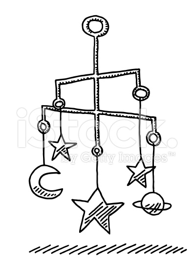

```{r echo=FALSE,message=FALSE}
library(GEOquery)
library(limma)
```

# Description

The tutorial covers the application of a number of techniques to real-life microarray experiments

- Clustering
    + and making a heatmap
- Principal Components Analysis
- Classification


# Data Pre-processing

We will re-use the colon cancer data in GSE33126, and saw yesterday how to import these data into R.

```{r cache=TRUE}
library(GEOquery)
url <- "ftp://ftp.ncbi.nih.gov/pub/geo/DATA/SeriesMatrix/GSE33126/"
filenm <- "data/GSE33126_series_matrix.txt.gz"
if(!file.exists("GSE33126_series_matrix.txt.gz")) download.file(paste(url, filenm, sep=""), destfile=filenm)
colonData <- getGEO(filename=filenm)
colonData
```

```{r}
exprs (colonData) <- log2 (exprs(colonData))
SampleGroup <- pData(colonData)$source_name_ch1
Patient <- pData(colonData)$characteristics_ch1.1
```

## Filtering the data

A first step in the analysis of microarray data is often to remove any uniformative probes.
We can do this because typically only 50% of probes genes will be expressed, and even fewer
than this will be differentially expressed. Including such non-informative genes in visualisa-
tion will obscure any biological differences that exist. The genefilter package contains a suite
of tools for the filtering of microarray data. The varFilter function allows probes with low-
variance to be removed from the dataset. The metric using to decide which probes to remove
is the Inter-Quartile Range (IQR), and by default half of the probes are removed. Both the
function used to do the filtering, and cut-off can be specified by the user.


```{r}
library (genefilter)
dim (colonData)
varFiltered <- varFilter (colonData)
dim (varFiltered)
nrow (colonData) / nrow (varFiltered)
```


## Clustering.. or Classification?

- **Unsupervised:** classes unknown, want to discover them from the data (cluster analysis)
- **Supervised:** classes are predefined, want to use a (training or learning) set of labelled objects to form a classifier for classification of future observations


# Clustering

## Why do clustering for genomic data?

- Clustering leads to readily interpretable figures and can be helpful for identifying patterns in time or space.
- We can cluster samples (columns)
    + e.g. identification of new / unknown tumor classes using gene expression profiles
- We can cluster genes (rows)
    + e.g. using large numbers of yeast experiments to identify groups of co-regulated genes
    + we can cluster genes to reduce redundancy (i.e. variable selection) in predictive models
    
### Subtype Discovery    
- There are plenty of examples of using clustering to discover subtypes in the literature


### Clustering as QA

- Also used as a quality assessment tool
    + to check for outlier samples


- Can check within / between experiment variability and potential confounding factors (batch effect etc)
    
    


### Clustering Overview

- Steps in a Cluster Analysis
    1. Preprocess the data
    2. Choose a *dissimilarity* measure
    3. Choose a cluster algorithm
    4. Select the number of clusters
    5. Validate the procedure
    

When clustering genes, it is common to pre-process;

- normalise
- filter; remove genes with low variability across samples and many missing values
- (impute missing values)
- standardise; e.g. zero-mean and, unit variance:
    + $y_g^* = (y_g - \mu_g)/\sigma_g$
    
### How to compute similarity
Common *Similarity* / *Dissimilarity* measures include

- Correlation coefficient; *scale invariant*
    + Pearson's correlation;
    + Spearman correlation of ranks
    
- Distance: scale dependant
    + Euclidean distance; $d(x,y) = \sqrt{\sum_i (x_i - y_i)^2}$
    + City block (Manhattan) distance; $d(x,y) = \sum | x_i - y_i |$
    + and others.....

- ***Warning***: Don't get too hung-up on the choice of measure
    + Clustering is primarily an exploratory tool
    + If your data has signal, it should show regardless of which measure you choose
    + Don't just pick the one which "looks the best"
    
### How to compute similarity, in R

The `dist` function can be used to calculate a variety of similarity measures

- As usual, we can do `?dist`. 
- The input is a matrix of numerical values
- Let's test with some sample data

```{r echo=FALSE}
set.seed(10032016)
```


```{r}
myMatrix <- matrix(rnorm(1000),ncol=10)
colnames(myMatrix) <- LETTERS[1:10]
head(myMatrix)
```


- The default is to compute distances from the *rows* of the matrix
    + i.e. which would normally be the genes we are measuring
- Also note that the matrix has some values that appear to be missing
    + why do you think that might be?

```{r eval=FALSE}
d <- dist(myMatrix)
d
```


- The more common use of clustering is to cluster the columns (*samples*)
- To do this, we have to *transpose* the matrix; using the function `t`

```{r}
d <- dist(t(myMatrix))
d
```


- Changing the type of distance measure can be done by changing the `method` argument

```{r}
d.man <- dist(t(myMatrix),method="manhattan")
d.man
```

### How to calculate correlation in R

- This time we use the `cor` function to calculate correlation(`?cor`)
- What do you notice about the output, compared to that of `dist`?

```{r}
cor(myMatrix)
```

- Clustering algorithms will expect input in distance matrix form
- We can convert using `as.dist`

```{r}
corMat <- as.dist(cor(myMatrix))
corMat
```

- Two samples with a *higher correlation* values means *more similar*
- ...so the *distance* between is *less*


```{r}
corMat <- as.dist(1-abs(cor(myMatrix)))
corMat
```


### Correlation versus Distance

- A simple toy example of three genes
    + which genes seem to be closest?


- Using Euclidean distance

```{r echo=FALSE}
gene2 <- c(-1, -0.5, 0.3, -0.4,0.7,0.9, 1.1,0.8,1.5,1.3)
gene1 <- gene2+2
gene3 <- gene1 + runif(10,min = -0.4,0.4)

geneMatrix <- rbind(gene1,gene2,gene3)
dist(geneMatrix)
```

- Correlation matrix

```{r echo=FALSE}
cor(t(geneMatrix))
par(mfrow=c(1,2))
plot(hclust(dist(geneMatrix)),main="Distance = Euclidean")
plot(hclust(as.dist(1-cor(t(geneMatrix)))),main="Distance = Correlation")

```


## Calculating a distance matrix for gene expression data

The first step towards clustering the data is to construct a distance matrix. Each entry in
this matrix is the pairwise distance between two samples. Note that for expression data we have to transpose the standard `ExpressionSet` format, as clustering is designed to work on
rows rather than columns. The standard function to make a distance matrix in R is `dist`
which uses the euclidean metric. As the data entries in a distance matrix are symmetrical, it
has a different representation to the default matrix (i.e. values are not repeated unnecessarily), and clustering algorithms are able to accept this representation as input.

**N.B. to calculate the distances between samples, we have to transpose the expression matrix (e.g. using the function `t`). If we do not do this, R will try and compute distances between all genes which may take a long time or exceed the available memory)**

```{r}
euc.dist <- dist (t(exprs(varFiltered)))
euc.dist
```

For gene-expression data, it is common to use correlation as a distance metric rather than
the Euclidean. You should make sure that you know the difference between the two metrics.
The `cor` function can be used to calculate the correlation of columns in a matrix. Each row
(or column) in the resulting matrix is the correlation of that sample with all other samples
in the dataset. The matrix is symmetrical and we can transform this into a distance matrix
by first subtracting 1 from the correlation matrix. Hence, samples with a higher correlation
have a smaller ’distance’.


```{r}
corMat <- cor(exprs(varFiltered))
corMat
cor.dist <- as.dist(1 - corMat)
```

The values given by the `cor` function can be either positive or negative, depending on whether two samples are positively or negatively correlated. However, for our distance matrix to contain only values in the range 0 to 1. In which case we would need to use the *absolute* values from the correlation matrix before converting to distances.

```{r}
cor.dist <- as.dist(1 - abs(corMat))
```


## Hierachical methods for clustering

- start with *n* samples (or $p$ gene) clusters
- At each step, *merge* the two closest clusters using a measure of *between-cluster* dissimilarity which reflects the shape of the clusters
- The distance between the clusters is defined by the method used (e.g. in *complete linkage*, the distance is defined as the distance between the furthest pair of points in the two clusters)


- Dendrograms are good visual guides, but *arbitrary*
- Nodes can be reordered
    + Closer on dendrogram $\ne$ more similar


### Performing hierachical clustering, in R

- The function to use here is `hclust` (`?hclust`)
- It takes a distance matrix that you computed previously

```{r}
clust <- hclust(d)
clust
```


- The standard plotting function has been extended to visualise the result of the clustering

```{r}
plot(clust)
```


- We can change the name of the method


```{r}
clust.ward <- hclust(d,method = "ward.D")
par(mfrow=c(1,2))
plot(clust)
plot(clust.ward)
```

    

******
Exercise:
- Apply hierachical clustering to the Eucliden and Correlation distance matrices from the Colon Cancer data that you computed previously
- Do you see the same clustering arising from the different distance matrices?

```{r}

## Your answer here ##

```
******


The default plotting for a dendrogram labels the "leaves" with the column names from the input matrix, in our case the sample names from GEO. This may make the interpretation of the dendrogram difficult, as it may not be obvious which sample group each sample belongs to. We can alter the appearance of the dendrogram so that sample groups appear in the labels.


```{r}
groups <- c(rep("Group1", 5),rep("Group2", 5))
groups
par(mfrow=c(1,2))
plot(clust,labels=groups)
plot(clust.ward)

```

It is helpful to think of the dendrogram as a mobile that you might see hanging in a child's nursery. 



******
Exercise:
- Add text labels to indicate which sample group each sample belongs to
    + does the clustering make sense in relation to the sample groups in the experiment? 
    + do any samples appear incorrectly clustered?
******

The `WGCNA` package in Bioconductor provides methods for finding clusters of correlated genes, which we will not be looking at in this tutorial. However, the package is of interest as it provides other visualisation methods for dendrograms which allows colours to be overlaid to distinguish sample groups.

```{r message=FALSE}
library(WGCNA)
```


```{r}
clust.euclid = hclust(euc.dist)
clust.cor = hclust (cor.dist)

groupColours <- as.factor(SampleGroup)
levels(groupColours) <- c ("yellow" , "blue")
plotDendroAndColors(clust.euclid,colors=groupColours)

```


## Extracting data from the clustering

If we want to interpret the data presented in a clustering analysis, we need a way of extract-
ing which samples are grouped together, or to determine the optimal grouping of samples.
One intuitive way of assigning groups it to ’cut’ the dendrogram at a particular height on
the y-axis. We can do this manually on the plot, or use the `cutree` function to return the
labels of samples that are belong to the same group when the dendrogram is cut at the specified height, `h`. Alternatively, we can specify how many groups, `k`, that we want to create.

```{r}
library (cluster)
par (mfrow = c(1 , 1))
plot(clust.cor)
abline (h = 0.12, col = " red ")
cutree (clust.cor , h = 0.12)
cutree (clust.cor , k = 2)
table (cutree(clust.cor , k = 3) , SampleGroup)
```

A Silhouette plot can be used to choose the optimal number of clusters. For each sample, we
calculate a value that quantifies how well it ’fits’ the cluster that it has been assigned to. If
the value is around 1, then the sample closely fits other samples in the same cluster. How-
ever, if the value is around 0 the sample could belong to another cluster. In the silhouette
plot, the values for each cluster are plotted together and ordered from largest to smallest.
The number of samples belonging to each group is also displayed.

```{r}
par (mfrow = c (2 , 2))
plot (silhouette(cutree(clust.cor, k=2),cor.dist),
      col="red",main=paste("k=",2))
plot (silhouette(cutree(clust.cor, k=3),cor.dist),
      col="red",main=paste("k=",3))
plot (silhouette(cutree(clust.cor, k=4),cor.dist),
      col="red",main=paste("k=",4))
plot (silhouette(cutree(clust.cor, k=5),cor.dist),
      col="red",main=paste("k=",5))
```


If we have prior knowledge of how many clusters to expect, we could run the clustering in a
supervised manner. The ***Partition Around Medioids*** method can be used to group samples
into k clusters.

```{r}
pam.clus <- pam (euc.dist , k = 2)
clusplot (pam.clus)
pam.clus$clustering
table(pam.clus$clustering , SampleGroup)
```


- Two useful functions are `cutree` and `rect.hclust`
- Can be used to "cut" the dendrogram at a particular height

```{r}
par(mfrow=c(1,1))
plot(clust)
cutree(clust, h=16)
rect.hclust(clust, h=16)
```


- Alternatively, we can see the number of clusters; *k*
- Try experimenting with different values of k....

```{r}
plot(clust)
cutree(clust, k=2)
rect.hclust(clust, k=2)
```


### What is the optimal number of clusters?

- A measure called the ***silhouette width*** can be computed.
- The silhouette measures how well-matched an object is to others in it's own cluster, versus how well-matched it would be if it were moved to the next closest cluster
- Value around 0 -> a gene lies between two clusters
- Value of -1 -> gene is similar to element in neighbour cluster and probably in the wrong cluster
- Value of around 1 -> good clustering
- Output from `silhouette` function for the gene expression example earlier

```{r echo=FALSE}
library(cluster)
d <- dist(t(exprs(data.noout)))
par(mfrow=c(1,2))
pr <- pam(d, 2)
si4 <- silhouette(pr)
par(mfrow=c(1,2))
plot(hclust(d))
rect.hclust(hclust(d),k=2)
plot(si4, col = c("red", "blue"),main="")# with cluster-wise coloring

```

    
    
## Summary of clustering

- Useful as ***exploratory / visualisation*** tools
- Choice of metric, methods and parameters usually guided by prior knowledge about the question
    + The result is guided by what you are looking for
- Validate using different algorithms
- Use prior Biological knowledge, or your sample meta data to see if the clusters make sense
- Be aware
    + Clustering will always produce something. It cannot NOT work
- Clustering is a generic technique that can be applied to many forms of data
    + We will use it on Microarrays, but it can be used on RNA-seq, ChIP, or other NGS data
- Quality assessment of samples
      + checking for batch effects and outliers
      + check effectiveness of normalisation / transformation
## Producing a heatmap

A heatmap is often used to visualise differences between samples. Each row represents a
gene and each column is an array and coloured cells indicate the expression levels of genes.
Both samples and genes with similar expression profile are clustered together. By default,
euclidean distances are used with complete linkage clustering.
Drawing a heatmap in R uses a lot of memory and can take a long time, therefore reducing the amount of data to be plotted is usually recommended. Including too many non-
informative genes can also make it difficult to spot patterns. Typically, data are filtered to
include the genes which tell us the most about the biological variation. In an un-supervised
setting, the selection of such genes is done without using prior knowledge about the sample
groupings.

```{r}
IQRs = apply (exprs(varFiltered) , 1 , IQR )
highVarGenes = order (IQRs, decreasing = T )[1:100]
Symbols <- as.character(fData(colonData)$Symbol[highVarGenes])
heatmap (as.matrix(exprs(varFiltered)[highVarGenes, ]),
         labCol = SampleGroup , labRow = Symbols)

```

The default options for the heatmap are to cluster both the genes (rows) and samples (columns).
However, sometimes we might want to specify a particular order. For example, we might
want to order the columns according to sample groups. We can do this by re-ordering the
input matrix manually and setting the `Colv` argument to `NA`. This tells the heatmap function not be
cluster the columns. 

```{r}
heatmap (as.matrix(exprs(varFiltered)[highVarGenes, ]),
         labCol = SampleGroup , labRow = Symbols,Colv=NA)
```

```{r}
heatmap (as.matrix(exprs(varFiltered)[highVarGenes, order(SampleGroup)]),
         labCol = SampleGroup[order(SampleGroup)], labRow = Symbols,Colv = NA)
```


Alternatively, a pre-calculated dendrogram could be used.

```{r}
clus.ward <- hclust (cor.dist , method = "ward")
heatmap (as.matrix(exprs(varFiltered)[highVarGenes, ]) ,
         Colv = as.dendrogram(clus.ward) , labCol = SampleGroup )

```

## Customising the heatmap

The heatmap function can be customised in many ways to make the output more informa-
tive. For example, the `labRow` and `labCol` parameters can be used to give labels to the rows
(genes) and columns (sample) of the heatmap. Similarly, `ColSideColors` and `RowSideColors` give coloured labels, often used to indicate different groups which are know in advance.
See the help page for heatmap for more details.

```{r}

heatmap(as.matrix(exprs(varFiltered)[highVarGenes, ]) ,
        labCol = Patient, ColSideColors = as.character(groupColours),
        labRow = Symbols)
```

The colours used to display the gene expression values can also be modified. For this, we
can use the `RColorBrewer` package which has functions for creating pre-defined palettes. The
function `display.brewer.all` can be used to display the palettes available through this
package. 

**You should avoid using the traditional red / green colour scheme as it may be difficult for people with colour-blindness to interpret!**


```{r}
library (RColorBrewer)
display.brewer.all()
hmcol <- brewer.pal(11 , "RdBu")
heatmap (as.matrix(exprs(varFiltered)[highVarGenes, ]) ,
  ColSideColors = as.character(groupColours) , labRow = Symbols,
  col=hmcol)
```


A popular use for heatmaps is to take an existing gene list (e.g. genes found to be significant
in a previous study, or genes belonging to a particular pathway) and produce an image of
how they cluster the data for exploratory purposes. This can be achieved by selecting
the correct rows in the data matrix.

```{r}
tests <- rowttests(exprs(varFiltered),SampleGroup)
N <- 50
myGenes <- rownames(tests)[1:N]
symbols <- fData(varFiltered)[myGenes,"Symbol"]
heatmap (as.matrix(exprs(varFiltered)[myGenes , ]),
  ColSideColors = as.character (groupColours) , labCol = Patient ,
  labRow = symbols , col = hmcol )
```


## Other packages that produce heatmaps

One drawback of the standard `heatmap` function is that it only allows one "track" of colours below the dendrogram. We might wish to display various sample groupings using this feature. The `heatmap.plus` package allows us to do just this.

```{r}
library(heatmap.plus)
colourMatrix <- matrix(nrow=length(SampleGroup),ncol=2)
patientCol <- rep(rainbow(n=length(unique(Patient))),each=2)
colourMatrix[,1] <- as.character(groupColours)
colourMatrix[,2] <- patientCol

heatmap.plus (as.matrix(exprs(varFiltered)[highVarGenes, ]) ,
  ColSideColors = as.matrix(colourMatrix) , labRow = Symbols,
  col=hmcol)

```

Another alternative is provided by the `gplots` package. The `heatmap.2` function can be used in the same fashion as `heatmap`. The plots produced include a colour legend for the cells in the heatmap. By default, a density plot of each column is also produced.

```{r}
library(gplots)
heatmap.2 (as.matrix(exprs(varFiltered)[highVarGenes, ]) ,
  ColSideColors = as.character(groupColours) , labRow = Symbols,
  col=hmcol)
```

We can turn-off the column density if we wish.

```{r}
heatmap.2 (as.matrix(exprs(varFiltered)[highVarGenes, ]) ,
  ColSideColors = as.character(groupColours) , labRow = Symbols,
  col=hmcol,trace="none")
```


# Principal Components Analysis

Principal components analysis (PCA) is a data reduction technique that allows us to simplify multidimensional data sets to 2 or 3 dimensions for plotting purposes and identify which
factors explain the most variability in the data. We can use the prcomp function to perform
a PCA and we have to supply it with a distance matrix. The resulting object contains information on the proportion of variance that is ’explained’ by each component. Ideally, we want
to see that the majority of the variance is explained by the first 2 or 3 components, and that
these components are associated with a biological factor

```{r}
pca <- prcomp(exprs(varFiltered))
plot(pca)
summary(pca)
```

The variable loadings are given by the `$rotation` matrix, which has one row for each sample and one column for each principal component. The principal components are ordered accorded to amount of variance explained. The actual values of a particular component have no meaning, but their relative values can be used to inform us about relationships between samples.

******
## Q  Does the first principal component appear to be related to the sample groups in the experiment? 
******

```{r}
head(pca$rotation)
boxplot(pca$rotation[,1]~SampleGroup)

```

Quite often, we plot the first few PCs against each other to visualise sample relationship. This can be achived with a scatter plot with the first principal component on the x-axis, and second principal component on the y-axis.


```{r}
plot(pca$rotation[,1],pca$rotation[,2])
```

We can improve this plot by adding colours for the different sample groups and choosing a different plotting character.

```{r}
plot(pca$rotation[,1],pca$rotation[,2],
     pch=16,col=as.character(groupColours))
```

We might also add a legend to explain the different colours. 

```{r}
plot(pca$rotation[,1],pca$rotation[,2],
     pch=16,col=as.character(groupColours))
legend("topright",fill=c("blue","yellow"),legend=c("tumour","normal"))
text(pca$rotation[,1],pca$rotation[,2]-0.01,labels = Patient)
```

Multi-dimensional Scaling (MDS) is a similar approach.  The distance between each pair of samples (columns) is the root-mean-square deviation (Euclidean distance) for the top top genes. Distances on the plot can be interpreted as leading log2-fold-change, meaning the typical (root-mean-square) log2-fold-change between the samples for the genes that distinguish those samples.

```{r}
library(limma)
plotMDS(exprs(varFiltered),col=as.character(groupColours),labels = Patient)
```


# Classification

The Bioconductor project has a collection of example datasets. Often these are used as examples to illustrate a particular package or functionality, or to accompany the analysis presented in a publication. For example, several datasets are presented to accompany the genefu
package which has functions useful for the classification of breast cancer patients based on
expression profiles.
An experimental dataset can be installed and loaded as with any other Bioconductor package. The data itself is saved as an object in the package. You will need to see the documentation for the package to find out the relevant object name. The full list of datasets available
through Bioconductor can be found [here](http://bioconductor.org/packages/release/BiocViews.html#___ExperimentData)

```{r}
library(breastCancerVDX)
library(breastCancerTRANSBIG)
data(vdx)
data(transbig)
dim(vdx)
dim(transbig)
annotation(vdx)
annotation(transbig)
```

If we want any classifers to be reproducible and applicable to other datasets, it is sensible
to exclude probes that do not have sufficient annotation from the analysis. For this, we can
use the genefilter package as before. The nsFilter function performs this annotation-based
filtering as well as variance filtering. The output of the function includes details about how
many probes were removed at each stage of the filtering.

```{r}
library (genefilter)
vdx.filt <- nsFilter(vdx)
vdx.filt
vdx.filt <- vdx.filt[[1]]
```

Format the vdx data for pamr, and train a classifier to predict ER status. For extra
clarity in the results, it might be useful to rename the binary er status used in the data package
to something more descriptive.

```{r}
library(pamr)
dat <- exprs(vdx.filt)
gN <- as.character(fData(vdx.filt)$Gene.symbol)
gI <- featureNames (vdx.filt)
sI <- sampleNames (vdx.filt)
erStatus <- pData (vdx)$er
erStatus <- gsub (0 , "ER -" , erStatus )
erStatus <- gsub (1 , "ER +" , erStatus )

```

Fitting the model

```{r}
train.dat <- list ( x = dat , y = erStatus , genenames = gN ,
              geneid = gI , sampleid = sI )
model <- pamr.train(train.dat ,n.threshold = 100)
model
```

We can perform cross-validation using the pamr.cv function. Printing the output of this
function shows a table of how many genes were used at each threshold, and the number of
classification errors. Both these values need to be taken into account when choosing a suit-
able theshold. The `pamr.plotcv` function can assist with this by producing a diagnostic plot
which shows how the error changes with the number of genes. In the plot produced by this
function there are two panels; the top one shows the errors in the whole dataset and the bottom one considers each class separately. In each panel, the x axis corresponds to the thresh-
old (and number of genes at each threshold) whereas the y-axis is the number of misclassifications.

```{r}
model.cv <- pamr.cv(model , train.dat , nfold = 10)
model.cv
pamr.plotcv(model.cv)
```

In the following sections, feel free to experiment with different values of the threshold
(which we will call `Delta`)
The misclassifications can easily be visualised as a ’confusion table’. This simply tabulates
the classes assigned to each sample against the original label assigned to the sample. e.g.
Misclassifications are samples that we thought were ’ER+’ but have been assigned to the
’ER-’ group by the classifier, or ’ER-’ samples assigned as ’ER+’ by the classifier.

```{r}
Delta <- 8
pamr.confusion(model.cv , Delta)
```

A visual representation of the class separation can be obtained using the `pamr.plotcvprob`
function. For each sample there are two circles representing the probabilty of that sample
being classified ER- (red) or ER+ (green).

```{r}
pamr.plotcvprob(model , train.dat , Delta )
```

There are a couple of ways of extract the details of the genes that have been used in the
classifier. We can list their names using the pamr.listgenes function, which in our case
these are just returns the microarray probe names. We can however, use these IDs to query
the `featureData` stored with the original `vdx` object. We can also plot the expression values
for each gene, coloured according to the class label.


```{r, fig.width=12,fig.height=12}
pamr.listgenes(model , train.dat , Delta )
classifierGenes <- pamr.listgenes(model , train.dat , Delta )[,1]
pamr.geneplot(model , train.dat ,Delta)
```

***You may get an error message Error in plot.new(): Figure margins too large
when trying to produce the gene plot. If this occurs, try increasing the size of your plotting
window, or decrease the number of genes by decreasing the threshold. Alternatively, the fol-
lowing code will write the plots to a pdf.***

```{r}
pdf ("classifierProfiles.pdf")
for (i in 1: length (classifierGenes)) {
  Symbol <- fData(vdx.filt)[classifierGenes[i] , "Gene.symbol"]
  boxplot(exprs(vdx.filt)[classifierGenes[i], ] ~ erStatus ,
  main = Symbol )
}
dev.off()
```

Use the genes identified by the classifier to produce a heatmap to confirm that they
separate the samples as expected.

```{r}

symbols <- fData(vdx.filt)[classifierGenes , "Gene.symbol"]
heatmap(exprs(vdx.filt)[classifierGenes, ] , labRow = symbols )

```


## Testing the model

We can now test the classifier on an external dataset. We choose the transbig dataset for
simplicity as it was generated on the same microarray platform

```{r}
library (breastCancerTRANSBIG)
data (transbig)
pData (transbig)[1:4, ]
transbig.filt <- transbig [featureNames(vdx.filt) , ]

```

```{r}
predClass <- pamr.predict(model ,exprs(transbig.filt) ,Delta )
table (predClass, pData(transbig)$ er)
boxplot (pamr.predict(model , exprs(transbig.filt), Delta ,
                           type = "posterior" )[, 1] ~ pData(transbig)$er)
```

Make a heatmap of the transbig data using the genes involved in the vxd classifier

```{r}
erLab <- as.factor(pData(transbig)$er)
levels (erLab) <- c ("blue" , "yellow")

heatmap (exprs(transbig.filt)[classifierGenes , ] , labRow = symbols ,
  ColSideColors = as.character (erLab))
```


# Survival Analysis


An attractive feature of the vdx dataset is that it includes survival data for each breast can-
cer patient. We are not explicitly covering survival analysis in this course, but for your reference, here are the commands to create survival curves when patients are grouped by ER
status and tumour grade.

```{r}
library (survival)
par (mfrow = c (1 , 2))
plot (survfit (Surv(pData(vdx)$t.dmfs , pData(vdx)$e.dmfs) ~
  pData(vdx)$er) , col = c("cyan" , "salmon"))

plot (survfit(Surv(pData(vdx)$t.dmfs , pData(vdx)$e.dmfs) ~
  pData (vdx)$grade) , col = c("blue" , "yellow" , "orange"))

survdiff(Surv(pData(vdx)$t.dmfs , pData(vdx)$e.dmfs) ~
  pData (vdx)$er)

survdiff(Surv(pData(vdx)$t.dmfs , pData(vdx)$e.dmfs) ~
  pData(vdx)$grade)
```

