# Description

The tutorial covers the application of a number of exploratory analysis techniques to real-life microarray experiments

- Clustering
    + and making a heatmap
- Principal Components Analysis
- Classification
- Survival

However, the techniques presented could be used on other types of data where you have genomic-observations in rows and samples in columns

# Data Pre-processing

We will re-use the colon cancer data in GSE33126, and saw yesterday how to import these data into R.

```{r cache=TRUE,message=FALSE,warning=FALSE}
library(GEOquery)
url <- "ftp://ftp.ncbi.nih.gov/pub/geo/DATA/SeriesMatrix/GSE33126/"
filenm <- "data/GSE33126_series_matrix.txt.gz"
if(!file.exists(filenm)) download.file(paste(url, filenm, sep=""), destfile=filenm)
colonData <- getGEO(filename=filenm)
colonData
```

We will log$_2$ transform the expression data to put on a more convenient scale for analysis

```{r}
exprs (colonData) <- log2 (exprs(colonData))
boxplot(exprs(colonData),outline=FALSE)
```

## Filtering the data

A first step in the analysis of microarray data is often to remove any uniformative probes.
We can do this because typically only 50% of probes genes will be expressed, and even fewer
than this will be differentially expressed. Including such non-informative genes in visualisa-
tion will obscure any biological differences that exist. As we mentioned yesterday, the `genefilter` package contains a suite
of tools for the filtering of microarray data. The `varFilter` function allows probes with low-
variance to be removed from the dataset. The metric using to decide which probes to remove
is the Inter-Quartile Range (IQR), and by default half of the probes are removed. Both the
function used to do the filtering, and cut-off can be specified by the user.


```{r}
library (genefilter)
dim (colonData)
varFiltered <- varFilter (colonData)
dim (varFiltered)
nrow (colonData) / nrow (varFiltered)
```


## Clustering.. or Classification?

- **Unsupervised:** classes unknown, want to discover them from the data (cluster analysis)
- **Supervised:** classes are predefined, want to use a (training or learning) set of labelled objects to form a classifier for classification of future observations

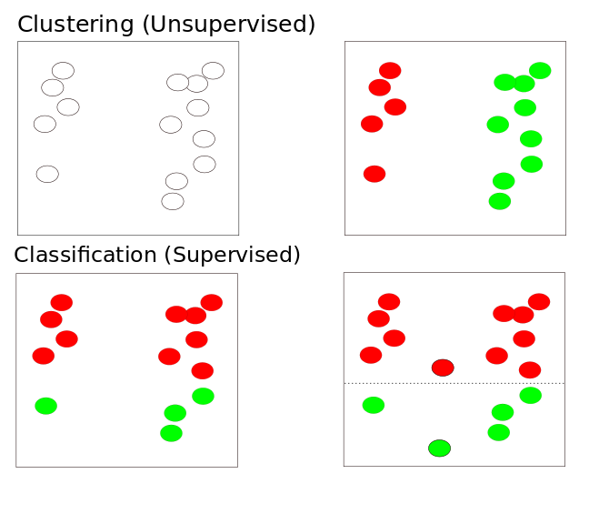


# Clustering

## Why do clustering for genomic data?

- Clustering leads to readily interpretable figures and can be helpful for identifying patterns in time or space.
- We can cluster samples (columns)
    + e.g. identification of new / unknown tumor classes using gene expression profiles
- We can cluster genes (rows)
    + e.g. using large numbers of yeast experiments to identify groups of co-regulated genes
    + we can cluster genes to reduce redundancy (i.e. variable selection) in predictive models
    
### Subtype Discovery    
- There are plenty of examples of using clustering to discover subtypes in the literature

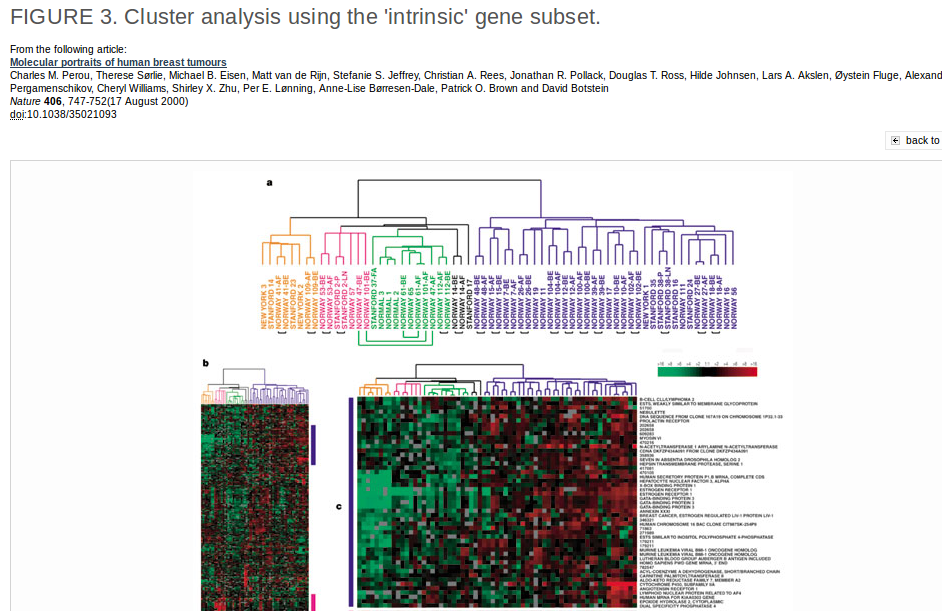

### Clustering as QA

- Also used as a quality assessment tool
    + to check for outlier samples

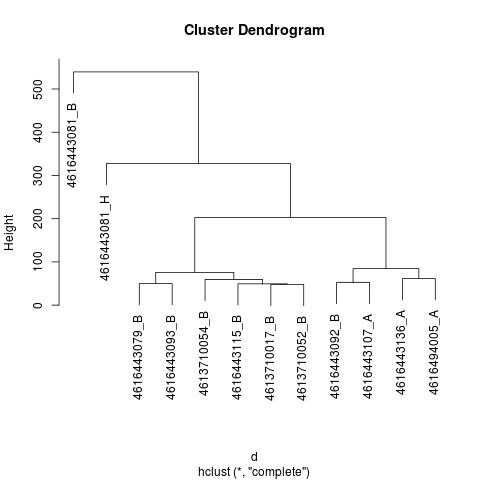


- Can check within / between experiment variability and potential confounding factors (batch effect etc)
    
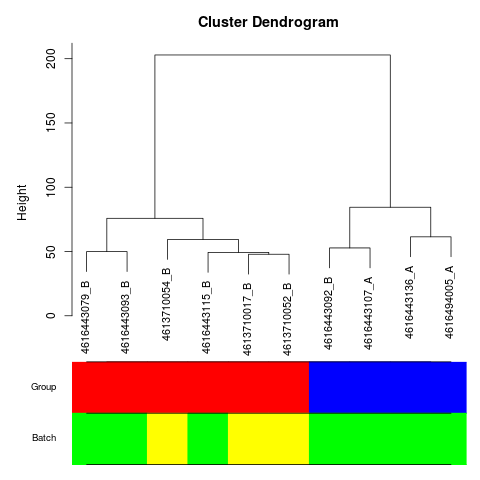    


### Clustering Overview

- Steps in a Cluster Analysis
    1. Preprocess the data
    2. Choose a *dissimilarity* measure
    3. Choose a cluster algorithm
    4. Select the number of clusters
    5. Validate the procedure
    

When clustering genes, it is common to pre-process;

- normalise
- filter; remove genes with low variability across samples and many missing values
- (possibly impute missing values)
- standardise; e.g. zero-mean and, unit variance:
    + $y_g^* = (y_g - \mu_g)/\sigma_g$
    + subtracting the mean expression level and divide by standard deviation
    + the algorithm may already do this
    
### How to compute similarity
Common *Similarity* / *Dissimilarity* measures include

- Correlation coefficient; *scale invariant*
    + Pearson's correlation;
    + Spearman correlation of ranks
    
- Distance: scale dependant
    + Euclidean distance; $d(x,y) = \sqrt{\sum_i (x_i - y_i)^2}$
    + City block (Manhattan) distance; $d(x,y) = \sum | x_i - y_i |$
    + and others.....

- ***Warning***: Don't get too hung-up on the choice of measure
    + Clustering is primarily an exploratory tool
    + If your data has signal, it should show regardless of which measure you choose
    + Don't just pick the one which "looks the best"
    
### How to compute similarity, in R

The `dist` function can be used to calculate a variety of similarity measures

- As usual, we can do `?dist`. 
- The input is a matrix of numerical values
- Let's test with some sample data
    + we use `set.seed` here to make sure we always get the same values


```{r}
set.seed(10032016)
myMatrix <- matrix(rnorm(1000),ncol=10)
colnames(myMatrix) <- LETTERS[1:10]
head(myMatrix)
```


- The default is to compute distances from the *rows* of the matrix
    + i.e. which would normally be the genes we are measuring
- Note that the output matrix has some values that appear to be missing
    + why do you think that might be?

```{r eval=FALSE}
d <- dist(myMatrix)
d
```


- The more common use of clustering is to cluster the columns (*samples*)
- To do this, we have to *transpose* the matrix; using the function `t`

```{r}
d <- dist(t(myMatrix))
d
```


- Changing the type of distance measure can be done by changing the `method` argument
    + as always, check the help page for full list of options `?dist`

```{r}
?dist
d.man <- dist(t(myMatrix),method="manhattan")
d.man
```

### How to calculate correlation in R

- This time we use the `cor` function to calculate correlation(`?cor`)
- What type of correlation is this computing?
    + use the help page to find out
- What do you notice about the output, compared to that of `dist`?

```{r}
cor(myMatrix)
```

- Clustering algorithms will expect input in distance matrix form
- We can convert using `as.dist`
    + recall that various `as.` functions exist to convert between various types of data. e.g. `as.numeric`, `as.character` etc
- Two samples with a *higher correlation* values means *more similar*
- ...so the *distance* between is *less*
    + `abs` will calculate the absolute value

```{r}
corMat <- as.dist(1-abs(cor(myMatrix)))
corMat
```


### Correlation versus Distance

- The main choice is whether to use a distance-based metric (e.g. Euclidean) or correlation
- A simple toy example of three genes
    + which genes seem to be closest?

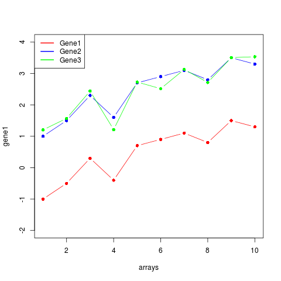

## Calculating a distance matrix for gene expression data

When clustering samples, each entry in the distance matrix should be the pairwise distance between two samples. As the `ExpressionSet` object has genes in the rows, and samples in the column we have to transpose the expression matrix.

**N.B. to calculate the distances between samples, we have to transpose the expression matrix (e.g. using the function `t`). If we do not do this, R will try and compute distances between all genes which may take a long time or exceed the available memory)**

```{r}
euc.dist <- dist (t(exprs(varFiltered)))
euc.dist
```

Or, if we wanted measures of correlation, we use the `cor` function as above

```{r}
corMat <- cor(exprs(varFiltered))
corMat
cor.dist <- as.dist(1 - corMat)
```


We are now ready to use a clustering algorithm


## Hierachical methods for clustering

- start with *n* samples (or $p$ gene) clusters
- At each step, *merge* the two closest clusters using a measure of *between-cluster* dissimilarity which reflects the shape of the clusters
- The distance between the clusters is defined by the method used (e.g. in *complete linkage*, the distance is defined as the distance between the furthest pair of points in the two clusters)


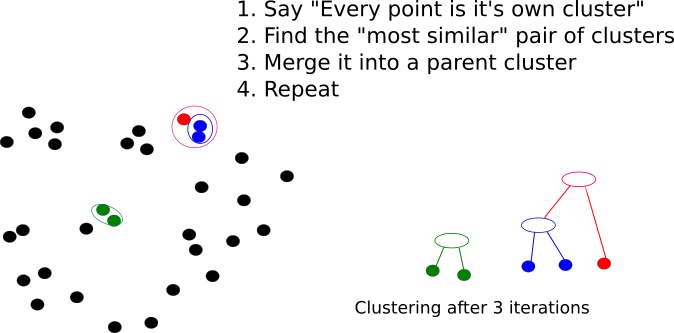

- We also have some control over the definition of distance used when creating a new cluster
    + this will alter the *shape* of the dendrogram
    + some methods will give more compact clusters

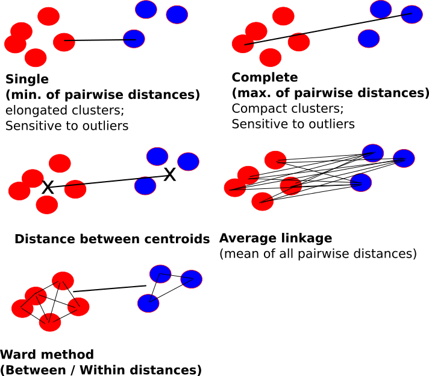


- Dendrograms are good visual guides, but the x-axis is *arbitrary*
- Nodes can be reordered
    + Closer on dendrogram $\ne$ more similar

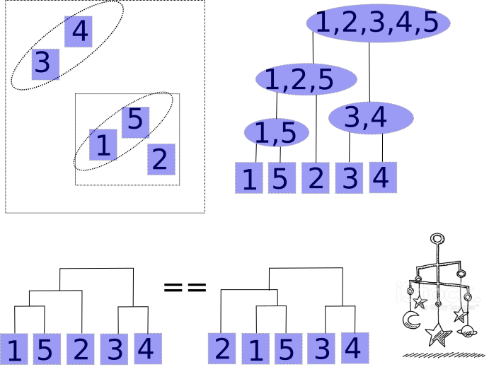


### Performing hierachical clustering, in R

- The function to use here is `hclust` (`?hclust`)
- It takes a distance matrix that you computed previously

```{r}
clust <- hclust(d)
clust
```

The summary provided when we print the object doesn't give much useful information

- we can access particular parts of the output with a `$`

```{r}
names(clust)
clust$order
```


- The standard plotting function has been extended to visualise the result of the clustering

```{r}
plot(clust)
```


- We can change the name of the method used to construct the clusters


```{r}
clust.ward <- hclust(d,method = "ward.D")
par(mfrow=c(1,2))
plot(clust)
plot(clust.ward)
```

    

******
Exercise:

- Apply hierachical clustering to the Eucliden and Correlation distance matrices from the Colon Cancer data that you computed previously
- Do you see the same clustering arising from the different distance matrices?

```{r}

## Your answer here ##

```
******


The default plotting for a dendrogram labels the "leaves" with the column names from the input matrix, in our case the sample names from GEO. This may make the interpretation of the dendrogram difficult, as it may not be obvious which sample group each sample belongs to. We can alter the appearance of the dendrogram so that sample groups appear in the labels.

- Can use the `labels` argument to specify a vector that you want to use to label each leaf
    + the vector must be in the same order as the columns in the matrix that you did clustering on

```{r}

plot(clust,labels=paste("Sample", 1:10))

```

******
Exercise:

- Add text labels to indicate which sample group (tumour or normal) that each sample belongs to
    + below is a reminder of how to retrieve a matrix with all the sample metadata
    + does the clustering make sense in relation to the sample groups in the experiment? 
    + do any samples appear incorrectly clustered?
    
    
    
******
```{r}
pd <- pData(colonData)
View(pd)
## Your answer here ##

```

The `WGCNA` package in Bioconductor provides methods for finding clusters of correlated genes, which we will not be looking at in this tutorial. However, the package is of interest as it provides other visualisation methods for dendrograms which allows colours to be overlaid to distinguish sample groups.

```{r message=FALSE}
library(WGCNA)
```

We need to create a vector of colours; one for each sample in our dataset

- we already know how to extract the sample group information from the metadata
- we can start by creating a vector containing just one colour name
    + e.g. using the `rep` function
    + then replace the entries corresponding to a tumour with a different value

```{r}
SampleGroup <- pData(colonData)$source_name_ch1
SampleGroup
groupColours <- rep("yellow",length(SampleGroup))
groupColours[SampleGroup == "tumor"] <- "blue"
groupColours
```


```{r}
clust.euclid = hclust(euc.dist)
plotDendroAndColors(clust.euclid,colors=groupColours)
```

Alternatively, one might re-set the *levels* of the vector to be the colours we want

```{r}
groupColours <- SampleGroup
levels(groupColours) <- c("yellow","blue")
```


## Extracting data from the clustering

If we want to interpret the data presented in a clustering analysis, we need a way of extracting which samples are grouped together, or to determine the optimal grouping of samples.

- One intuitive way of assigning groups it to *cut* the dendrogram at a particular height on the y-axis. 
- We can do this manually on the plot, or use the `cutree` function to return the
labels of samples that are belong to the same group when the dendrogram is cut at the specified height, `h`. 
- Alternatively, we can specify how many groups, `k`, that we want to create.

```{r}
library (cluster)
plot(clust.euclid)
abline (h = 120, col = " red ")
cutree (clust.euclid , h =120)
cutree (clust.euclid , k = 3)
table (cutree(clust.euclid , k = 3) , SampleGroup)
```


## Summary of clustering

- Useful as ***exploratory / visualisation*** tools
- Choice of metric, methods and parameters usually guided by prior knowledge about the question
    + The result is guided by what you are looking for
- Validate using different algorithms
- Use prior Biological knowledge, or your sample meta data to see if the clusters make sense
- Be aware
    + Clustering will always produce something. It cannot NOT work
- Clustering is a generic technique that can be applied to many forms of data
    + We will use it on Microarrays, but it can be used on RNA-seq, ChIP, or other NGS data
- Quality assessment of samples
      + checking for batch effects and outliers
      + check effectiveness of normalisation / transformation
      
      
## Producing a heatmap

A heatmap is often used to visualise differences between samples. 

- Each row represents a gene and each column is an array and coloured cells indicate the expression levels of genes.
- Both samples and genes with similar expression profile are clustered together. 
- The code to draw the heatmap is actually quite straighforward
    + the trick is to select what genes to use

Drawing a heatmap in R uses a lot of memory and can take a long time, 

- Reducing the amount of data to be plotted is usually recommended. 
- Including too many non-informative genes can also make it difficult to spot patterns. 
- Typically, data are filtered to include the genes which tell us the most about the biological variation. 
    + alternatively, use a pre-selected list of genes of interest
    + e.g. a particular pathway, or gene-list from another study
- In an un-supervised setting, the selection of such genes is done without using prior knowledge about the sample groupings.
- The `rowSds` function from `genefilter` provides a convenient way of calculating the variability of each gene

```{r}
geneVar = rowSds(exprs(colonData))
sd(exprs(colonData)[1,])
geneVar[1]
sd(exprs(colonData)[2,])
geneVar[2]
length(geneVar)
```

Next we can select which genes have the highest variance (say the top 100)

```{r}
highVarGenes = order (geneVar, decreasing = TRUE )[1:100]
```

- A basic heatmap can now be constructed by selecting the appropriate rows from the expression matrix
    + the `heatmap` function expects a `matrix` object, so we have to convert
    + as we will see it can be customised in lots of ways
    + `labCol` allows us to label the columns in the plot (default is to use the column names from the original matrix used for clustering)
    
    
```{r}
heatmap (as.matrix(exprs(colonData)[highVarGenes, ]),labCol = SampleGroup)
```

******
Exercise:

- Does the clustering of samples look correct?
    + are there any issues you can spot?
    
******

## Customising the heatmap

From this plot we can already to discern patterns in the data

In a similar way to adding colours to a dendrogram (with `plotDendroAndColors`), we can add a colour bar underneath the sample dendrogram in the heatmap

- the argument to look for is `ColSideColors`
    + only one band of colour is supported though

```{r}
heatmap (as.matrix(exprs(colonData)[highVarGenes, ]),
         labCol = SampleGroup,
         ColSideColors = as.character(groupColours))

```
- However, the rows are named according to the row names in the expression matrix
    + which in this case are manufacturer identifiers and do not help the interpretation


******
Exercise:

- How can we add gene names to the heatmap?
    + first out which column in the feature data corresponds to gene symbol
    + save this as a vector
    + find out which argument to heatmap you need to change
    
******

    
```{r}

features <- fData(colonData)
View(features)

## Your answer here ##


```


- The default options for the heatmap are to cluster both the genes (rows) and samples (columns).
- However, sometimes we might want to specify a particular order. For example, we might
want to order the columns according to sample groups. 
- We can do this by re-ordering the input matrix manually and setting the `Colv` argument to `NA`. This tells the heatmap function not be cluster the columns. 

```{r}
heatmap (as.matrix(exprs(colonData)[highVarGenes, ]),
         labCol = SampleGroup , Colv=NA)
```

In this plot we set the column order according to the Sample Group
```{r}
heatmap (as.matrix(exprs(colonData)[highVarGenes, order(SampleGroup)]),
         labCol = SampleGroup[order(SampleGroup)], Colv = NA)
```


Alternatively, a pre-calculated dendrogram could be used.

```{r}
clus.ward <- hclust (euc.dist , method = "ward")
heatmap (as.matrix(exprs(colonData)[highVarGenes, ]) ,
         Colv = as.dendrogram(clus.ward) , labCol = SampleGroup )

```


The colours used to display the gene expression values can also be modified. For this, we
can use the `RColorBrewer` package which has functions for creating pre-defined palettes. The
function `display.brewer.all` can be used to display the palettes available through this
package. 

**You should avoid using the traditional red / green colour scheme as it may be difficult for people with colour-blindness to interpret!**


```{r}
library (RColorBrewer)
display.brewer.all()
hmcol <- brewer.pal(11 , "RdBu")
heatmap (as.matrix(exprs(colonData)[highVarGenes, ]) ,
  ColSideColors = as.character(groupColours) , col=hmcol)
```

## Other packages that produce heatmaps

One drawback of the standard `heatmap` function is that it only allows one "track" of colours below the dendrogram. We might wish to display various sample groupings using this feature. The `heatmap.plus` package allows us to do just this.

```{r}
library(heatmap.plus)
colourMatrix <- matrix(nrow=length(SampleGroup),ncol=2)

Patient <- pd$characteristics_ch1.1
patientCol <- rep(rainbow(n=length(unique(Patient))),each=2)
colourMatrix[,1] <- as.character(groupColours)
colourMatrix[,2] <- patientCol

heatmap.plus (as.matrix(exprs(colonData)[highVarGenes, ]) ,
  ColSideColors = as.matrix(colourMatrix) , col=hmcol)

```

Another alternative is provided by the `gplots` package. The `heatmap.2` function can be used in the same fashion as `heatmap`. The plots produced include a colour legend for the cells in the heatmap. By default, a density plot of each column is also produced.

```{r}
library(gplots)
heatmap.2 (as.matrix(exprs(colonData)[highVarGenes, ]) ,
  ColSideColors = as.character(groupColours) , col=hmcol)
```

We can turn-off the column density if we wish.

```{r}
heatmap.2 (as.matrix(exprs(colonData)[highVarGenes, ]) ,
  ColSideColors = as.character(groupColours) , col=hmcol,trace="none")
```
## (Extra) What is the correct number of clusters?

A *Silhouette plot* can be used to choose the optimal number of clusters. For each sample, we calculate a value that quantifies how well it 'fits' the cluster that it has been assigned to. If the value is around 1, then the sample closely fits other samples in the same cluster. However, if the value is around 0 the sample could belong to another cluster. In the silhouette plot, the values for each cluster are plotted together and ordered from largest to smallest. The number of samples belonging to each group is also displayed. 

The `silhouette` function is used to calculate this measure, and requires the output from a clustering method and the corresponding distance matrix.

```{r}
silhouette(cutree(clust.euclid, k = 2),euc.dist)
```


```{r fig.width=12}
par(mfrow=c(2,2))
plot(silhouette(cutree(clust.euclid, k = 2), euc.dist), col = "red", main = paste("k=", 2))
plot(silhouette(cutree(clust.euclid, k = 3), euc.dist), col = "red", main = paste("k=", 3))
plot(silhouette(cutree(clust.euclid, k = 4), euc.dist), col = "red", main = paste("k=", 4))
plot(silhouette(cutree(clust.euclid, k = 5), euc.dist), col = "red", main = paste("k=", 5))
```

The `pvclust` package is also able to provide some assessment on whether the clusters you get are significant or not.

- `install.packages(pvclust)`

- If we have prior knowledge (as we do for this dataset) we might be tempted to use a supervised method that takes the number of expected clusters into account
    + we can compare to the what we obtain from an unsupervised method
    + more on this later, but here is a taster of what such supervised methods can do

```{r}
library(cluster)
supervised.clus <- pam(euc.dist,k=2)
clusplot(supervised.clus)
supervised.clus$clustering
table(supervised.clus$clustering,SampleGroup)

```


# Principal Components Analysis


## Why Use PCA

- In genomic data, we have a large number of variables which are often highly correlated
- PCA is one of many *dimension-reduction* techniques that can remove redundancy and give a smaller more mangeable set of variables. In summary it can help us to:-

- Reduce *dimensionality* of the data
- Decrease the *redundancy* of the data
- Filter the *noise* in the data
- *Compress* the data


## PCA Example: Whisky

The data: 86 malt whiskies scored for 12 different taste categories

(https://www.mathstat.strath.ac.uk/outreach/nessie/nessie_whisky.html)

- Q. Can we find which whiskies have a similar taste profile?
- Q. What are the factors that determine the taste profile?
- Q. What other types of whisky are similar to my favourite?

```{r echo=FALSE}
download.file("https://www.mathstat.strath.ac.uk/outreach/nessie/datasets/whiskies.txt",destfile = "whiskies.txt")
whisky <- read.csv("whiskies.txt")
scores <- whisky[,c(3:14)]
rownames(scores) <- whisky$Distillery
scores
```

## What does PCA tell us for these data?

Allows us to visualise the dataset in two (perhaps three) dimensions and see the main sources of variation in the data

- in this case, which samples taste most similar


It is particularly useful to overlay known sample attributes to the plot

- can explain the similarities between whiskies

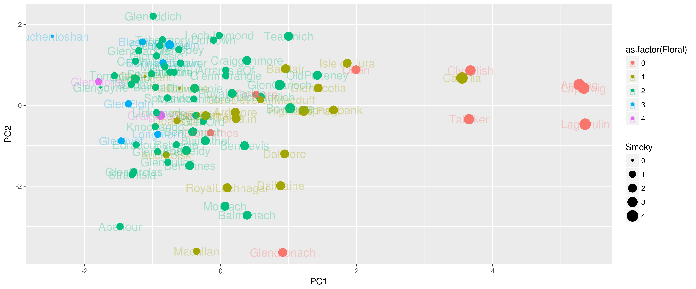

## More-relevant example

- MAQC microarrays with mixtures of Brain and Reference RNA (UHRR) at different concentrations
- Run in different labs
    + what do you notice?
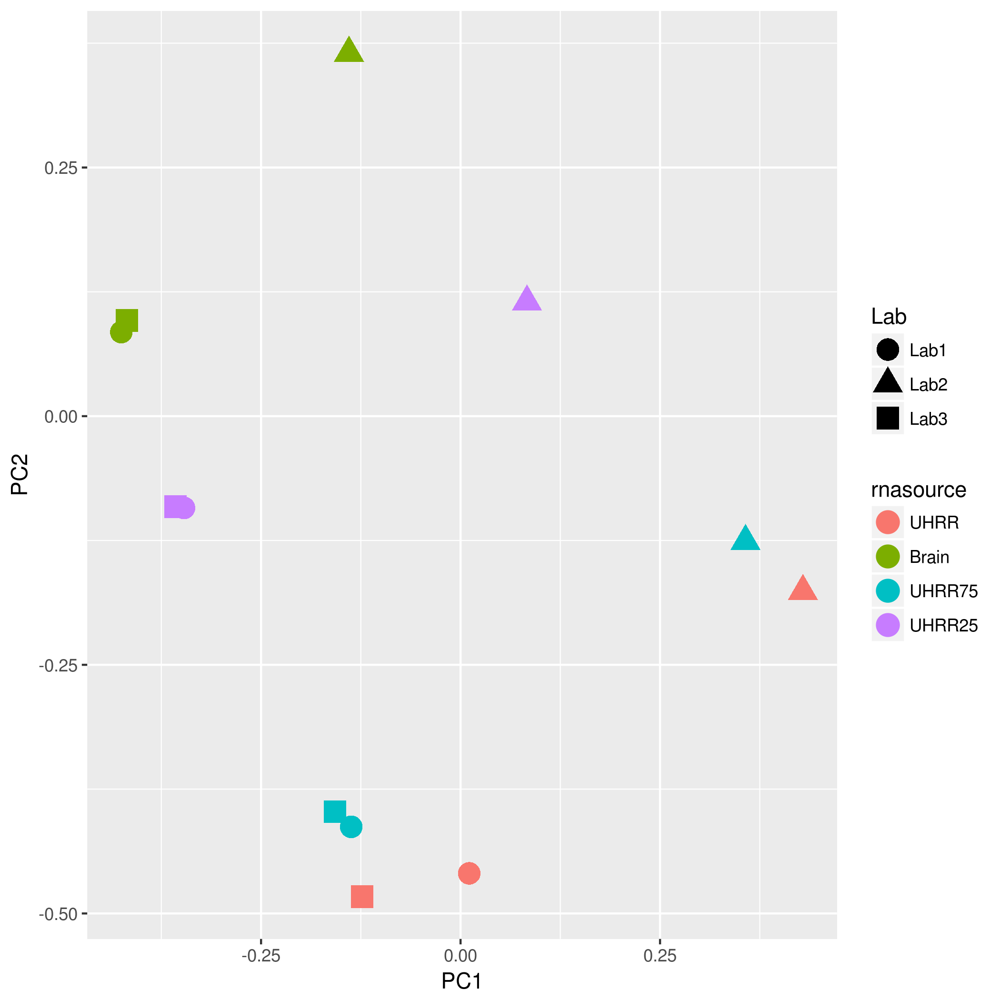


So, PCA can be used as a quality assessment tool and can inform us of any factors we need to account for in the analysis

- In this case we could correct for the batch effect, or add a batch factor to the linear model for analysis

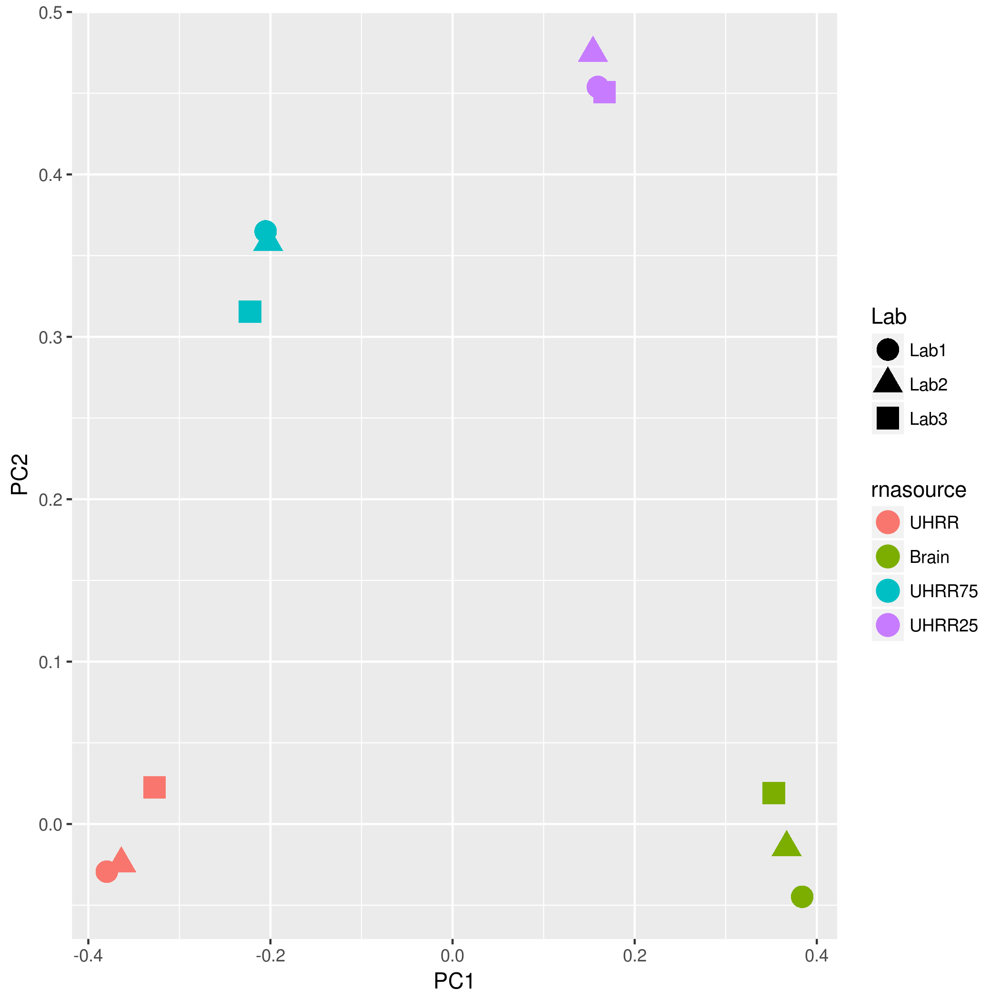

## What is going-on here?

A two-dimensional case

- Find direction of most variation (PC1)
- Direction that explains next amount of variation is orthogonal (at 90 degrees) (PC2)
- Each point on original x and y is a linear combination of PC1 and PC2
- Higher dimensional data can have many more components PC3, PC4....
    + although they will become increasingly less-influential

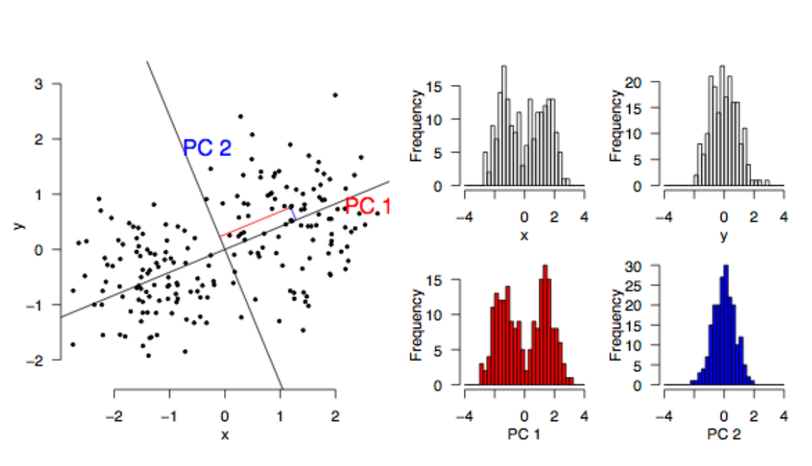


## Running the PCA

The `prcomp` function does the hard-work for us

- It is computing *eigenvectors* and *eigenvalues* from our input matrix
    + or rather the covariance matrix
- We have 12 components (as we had 12 variables)
- The components are ordered according to the amount of variance they *explain*

```{r}
scores
pca <- prcomp(scores)
pca
names(pca)
summary(pca)

```


## Dissecting the PCA results

The variable loadings are given by the `$rotation` matrix, which has one row for each sample and one column for each principal component. 

- The principal components are ordered accorded to amount of variance explained. 
- The actual values of a particular component have no meaning, 
    + but their relative values can be used to inform us about relationships between samples.
    + e.g. Smoky seems to be important for PC1
    + Smoky and Floral are opposite ends of the spectrum for PC1

```{r}
pca$rotation
```

    

## How many components?

We look at the variance explained by each component and judge where it "drops-off"

- Sometimes called a "scree-plot"
```{r}
plot(pca)
```


The new co-ordinate system is given by `pca$x`

- One row for each of our whiskies, one column for each component
- The original coordinates are a linear combination of the new ones
    + an exercise for the reader?

```{r}
pca$x[1:3,1:5]
```

Plotting the first and second columns as a scatter plot gives the plot we saw above


```{r}
plot(pca$x[,1],pca$x[,2],
     pch=16)
```

### Digression about ggplot2

The `ggplot2` package was actually used to create the plots above.

- Beyond the scope of the course, but you should check out our [Intermediate R](http://bioinformatics-core-shared-training.github.io/r-intermediate/) course for more details
- Essentially, it allows us to map between the variables in our data and the characteristics of the plot
    + x- and y-axis position, colour, shape, size of points


```{r}
df <- data.frame(whisky,pca$x)
df
library(ggplot2)
p <- ggplot(df, aes(x=PC1,y=PC2,label=Distillery)) + geom_point() + geom_text(alpha=0.3)
p
```

```{r}
p <- ggplot(df, aes(x=PC1,y=PC2,label=Distillery,cex=Smoky,col=as.factor(Floral))) + geom_point() + geom_text(cex=5,alpha=0.3)
p

```

## Applying PCA to gene expression data

In the above example, we had several whiskies and had made several observations about each

- Each row was a whisky, and the observations were in columns

In the gene expression case, we have biological samples and the measurements we have made are gene expression levels

- So for PCA we need to transpose the matrix 
    + like we did prior to clustering
- We can then proceed as before

```{r}
pca.geneExpression <- prcomp(t(exprs(varFiltered)))
summary(pca.geneExpression)
plot(pca.geneExpression)
```

This time, the matrix `$rotation` has one row for each gene and one column for each component

- We are more interested in the new (projected) coordinates and how they relate to the (known) sample groups
    + remember these are found in `$x`

```{r}
head(pca.geneExpression$rotation)
head(pca.geneExpression$x)

```

Quite often, we plot the first few PCs against each other to visualise sample relationship. 

- This can be achived with a scatter plot with the first principal component on the x-axis, and second principal component on the y-axis.
    + the samples clearly seem to separate, but is this separation consistent with the metadata?
  
```{r}
plot(pca.geneExpression$x[,1],pca.geneExpression$x[,2])
```

We can improve this plot by adding colours for the different sample groups and choosing a different plotting character.

```{r}
plot(pca$x[,1],pca$x[,2],
     pch=16,col=as.character(groupColours))

```

We might also add a legend to explain the different colours. 

```{r}
plot(pca.geneExpression$x[,1],pca.geneExpression$x[,2],
     pch=16,col=as.character(groupColours))
legend("bottomright",fill=c("blue","yellow"),legend=c("tumour","normal"))

text(pca.geneExpression$x[,1],pca.geneExpression$x[,2]-0.01,labels = pd$geo_accession)
```

Happily, the first component seems to separate the tumours from normals

- We can also see this with a boxplot
- To find what the other components relate to, we would have to use other information in the metadata
    + there doesn't seem to be anything useful though
    + we should try and capture as much metadata as possible; batch, age of patient, tumour purity...
    
```{r}
boxplot(pca.geneExpression$x[,1] ~ SampleGroup)
```


# Classification

The Bioconductor project has a collection of example datasets. Often these are used as examples to illustrate a particular package or functionality, or to accompany the analysis presented in a publication. For example, several datasets are presented to accompany the `genefu`
package which has functions useful for the classification of breast cancer patients based on
expression profiles.
An experimental dataset can be installed and loaded as with any other Bioconductor package. The data itself is saved as an object in the package. You will need to see the documentation for the package to find out the relevant object name. The full list of datasets available
through Bioconductor can be found [here](http://bioconductor.org/packages/release/BiocViews.html#___ExperimentData)

```{r}
library(breastCancerVDX)
library(breastCancerTRANSBIG)
data(vdx)
data(transbig)
dim(vdx)
dim(transbig)
annotation(vdx)
annotation(transbig)
```

If we want any classifers to be reproducible and applicable to other datasets, it is sensible
to exclude probes that do not have sufficient annotation from the analysis. For this, we can
use the genefilter package as before. The `nsFilter` function performs this annotation-based
filtering as well as variance filtering. The output of the function includes details about how
many probes were removed at each stage of the filtering.

```{r}
library (genefilter)
vdx.filt <- nsFilter(vdx)
vdx.filt
vdx.filt <- vdx.filt[[1]]
```

Format the vdx data for pamr, and train a classifier to predict ER status. For extra
clarity in the results, it might be useful to rename the binary er status used in the data package
to something more descriptive.

```{r}
library(pamr)
dat <- exprs(vdx.filt)
gN <- as.character(fData(vdx.filt)$Gene.symbol)
gI <- featureNames (vdx.filt)
sI <- sampleNames (vdx.filt)
erStatus <- pData (vdx)$er
erStatus <- gsub (0 , "ER -" , erStatus )
erStatus <- gsub (1 , "ER +" , erStatus )

```

Fitting the model

```{r}
train.dat <- list ( x = dat , y = erStatus , genenames = gN ,
              geneid = gI , sampleid = sI )
model <- pamr.train(train.dat ,n.threshold = 100)
model
```

We can perform cross-validation using the pamr.cv function. Printing the output of this
function shows a table of how many genes were used at each threshold, and the number of
classification errors. Both these values need to be taken into account when choosing a suit-
able theshold. The `pamr.plotcv` function can assist with this by producing a diagnostic plot
which shows how the error changes with the number of genes. In the plot produced by this
function there are two panels; the top one shows the errors in the whole dataset and the bottom one considers each class separately. In each panel, the x axis corresponds to the thresh-
old (and number of genes at each threshold) whereas the y-axis is the number of misclassifications.

```{r fig.width=12,fig.height=12}
model.cv <- pamr.cv(model , train.dat , nfold = 10)
model.cv
pamr.plotcv(model.cv)
```

In the following sections, feel free to experiment with different values of the threshold
(which we will call `Delta`)
The misclassifications can easily be visualised as a ’confusion table’. This simply tabulates
the classes assigned to each sample against the original label assigned to the sample. e.g.
Misclassifications are samples that we thought were ’ER+’ but have been assigned to the
’ER-’ group by the classifier, or ’ER-’ samples assigned as ’ER+’ by the classifier.

```{r}
Delta <- 8
pamr.confusion(model.cv , Delta)
```

A visual representation of the class separation can be obtained using the `pamr.plotcvprob`
function. For each sample there are two circles representing the probabilty of that sample
being classified ER- (red) or ER+ (green).

```{r}
pamr.plotcvprob(model , train.dat , Delta )
```

There are a couple of ways of extract the details of the genes that have been used in the
classifier. We can list their names using the pamr.listgenes function, which in our case
these are just returns the microarray probe names. We can however, use these IDs to query
the `featureData` stored with the original `vdx` object. We can also plot the expression values
for each gene, coloured according to the class label.


```{r, fig.width=12,fig.height=12}
pamr.listgenes(model , train.dat , Delta )
classifierGenes <- pamr.listgenes(model , train.dat , Delta )[,1]
pamr.geneplot(model , train.dat ,Delta)
```

***You may get an error message Error in plot.new(): Figure margins too large
when trying to produce the gene plot. If this occurs, try increasing the size of your plotting
window, or decrease the number of genes by decreasing the threshold. Alternatively, the fol-
lowing code will write the plots to a pdf.***

```{r}
pdf ("classifierProfiles.pdf")
for (i in 1: length (classifierGenes)) {
  Symbol <- fData(vdx.filt)[classifierGenes[i] , "Gene.symbol"]
  boxplot(exprs(vdx.filt)[classifierGenes[i], ] ~ erStatus ,
  main = Symbol )
}
dev.off()
```

Use the genes identified by the classifier to produce a heatmap to confirm that they
separate the samples as expected.

```{r}

symbols <- fData(vdx.filt)[classifierGenes , "Gene.symbol"]
heatmap(exprs(vdx.filt)[classifierGenes, ] , labRow = symbols )

```


## Testing the model

We can now test the classifier on an external dataset. We choose the transbig dataset for
simplicity as it was generated on the same microarray platform

```{r}
library (breastCancerTRANSBIG)
data (transbig)
pData (transbig)[1:4, ]
transbig.filt <- transbig [featureNames(vdx.filt) , ]

```

```{r}
predClass <- pamr.predict(model ,exprs(transbig.filt) ,Delta )
table (predClass, pData(transbig)$ er)
boxplot (pamr.predict(model , exprs(transbig.filt), Delta ,
                           type = "posterior" )[, 1] ~ pData(transbig)$er)
```

Make a heatmap of the transbig data using the genes involved in the vxd classifier

```{r}
erLab <- as.factor(pData(transbig)$er)
levels (erLab) <- c ("blue" , "yellow")

heatmap (exprs(transbig.filt)[classifierGenes , ] , labRow = symbols ,
  ColSideColors = as.character (erLab))
```


# Survival Analysis


An attractive feature of the vdx dataset is that it includes survival data for each breast can-
cer patient. We are not explicitly covering survival analysis in this course, but for your reference, here are the commands to create survival curves when patients are grouped by ER
status and tumour grade.

```{r}
library (survival)
par (mfrow = c (1 , 2))
plot (survfit (Surv(pData(vdx)$t.dmfs , pData(vdx)$e.dmfs) ~
  pData(vdx)$er) , col = c("cyan" , "salmon"))

plot (survfit(Surv(pData(vdx)$t.dmfs , pData(vdx)$e.dmfs) ~
  pData (vdx)$grade) , col = c("blue" , "yellow" , "orange"))

survdiff(Surv(pData(vdx)$t.dmfs , pData(vdx)$e.dmfs) ~
  pData (vdx)$er)

survdiff(Surv(pData(vdx)$t.dmfs , pData(vdx)$e.dmfs) ~
  pData(vdx)$grade)
```

