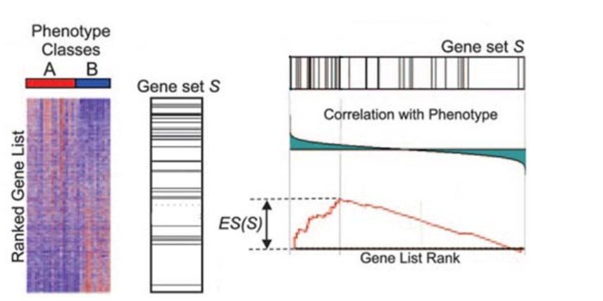

```{r echo=FALSE,message=FALSE}
library(GEOquery)
library(limma)
```

# Gene-Ontologies and Annotation

## Gene-Ontology Analysis

In the early days of microarray analysis, people were happy if they got a handful of differentially-expressed genes that they could validate or follow-up. However, with later technologies (and depending on the experimental setup) we might have thousands of statistically-significant results, which no-one has the time to follow-up. Also, we might be interested in pathways / mechanisms that are altered and not just individual genes.

In this section we move towards discovering if our results are ***biologically significant***. Are the genes that we have picked statistical flukes, or are there some commonalities. 

There are two different approaches one might use, and we will cover the theory behind both

- There is also a bunch of websites for doing the tests
    + we will show how they are done in Bioconductor so the theory is clear
- We will assume we have done a differential-expression analysis, but the same techniques can be used for other situations when we have a gene list
    + ChIP-seq
    + RNA-seq
    

## Theory Part I: Over-representation analysis

- "Threshold-based": require defintion of a statistical threshold to define list of genes to test (e.g. FDR < 0.01)
- Hypergeometric test or Fisher's Exact test generally used.

The question we are asking here is;

> ***"Are the number of DE genes associated with Theme X significantly greater than what we might expect by chance alone?"***

Where Theme X could be genes belonging to a particular GO (Gene Onotology) term.

Let's imagine that we have a bag full of balls. Each balls represents a gene in the *gene universe*. 
- Paint the balls representing our selected list grey, and paint the rest red.


In this small example, we can define;

- Total number of balls: 40
- Total number of interesting (grey) balls: 10

Now, lets select a number (say, 12) of the balls at random without seeing into the bag and look at what we get


We have picked, at random, 8 grey balls. Using simulations, we can repeat the process and look at how many grey we get. We can (of course!) do this in R. In base R there is a family of functions that can generate random draws from various distributions; `rnorm`, `rbinom`, `rhyper` etc....

The distribution of the data shows what the most-likely values are

```{r}
#see ?rhyper for argument definition
trials <- rhyper(10000,40,10,12)
hist(trials)
```

We can count how many times each value is observed

```{r}
table(trials)
```

Dividing by the number of trials gives a probability of sorts

```{r}
table(trials)/10000

```

The probability of getting *at least* a certain number can also be computed

```{r}
cumsum(table(trials)/10000)
1-cumsum(table(trials)/10000)
```


Back to our example, the distribution of balls can be expressed as a contingency table, on which we can use a Fisher's exact test

Total grey balls: 10
Total in subset: 12

```{r}
df <- data.frame(Selection_in = c(8,4), Selection_out = c(2,26))
rownames(df) <- c("Grey_in", "Grey_out")
df
```


```{r}
df <- data.frame(Selection_in = c("a","c","a+c"), Selection_out = c("b","d","b+d"), RowTotal = c("a +b","c+d","a+b+c+d (=n)"))
rownames(df) <- c("Grey_in", "Grey_out","Column Total")
df
```

The formula for Fishers exact test is;

$$ p = \frac{\binom{a + b}{a}\binom{c +d}{c}}{\binom{n}{a +c}} = \frac{(a+b)!(c+d)!(a+c)!(b+d)!}{a!b!c!d!n!} $$

or less formally;

*P = (ways of choosing grey balls) X (ways of non-grey balls amongst subset) / ways of choosing subset*


**Be careful of how you define the universe**

What genes were candidates for selection as universe?

- All possible genes
- All genes represented on the chip
- All genes that have a GO annotation
- All genes from the chip that pass a **non-specific** filter

Just changing the size of the universe alone can have a massive effect on the p-value

- In the formula, we have to divide by the universe size
    + so the probability will become very small as this increases
    + even if all the other numbers stay the same

```{r}
## Code from Seth Falcon
P <- function(size){
  nFound <- 10
  nDrawn <- 400
  nAtCat <- 40
  nNotAtCat <- size - nAtCat
  phyper(nFound-1, nAtCat,nNotAtCat,nDrawn,lower.tail = FALSE)
}
P(1000)
P(5000)
```


## Preparing the data for an over-representation test

As before, we download the data from GEO.

```{r cache=TRUE}
library(GEOquery)
library(genefilter)
url <- "ftp://ftp.ncbi.nih.gov/pub/geo/DATA/SeriesMatrix/GSE33126/GSE33126_series_matrix.txt.gz"
filenm <- "data/GSE33126_series_matrix.txt.gz"
if(!file.exists("data/GSE33126_series_matrix.txt.gz")) download.file(url, destfile=filenm)
colonData <- getGEO(filename=filenm)
colonData
```

Remember that we also need to do the log$_2$ transformation

```{r}
exprs(colonData) <- log2(exprs(colonData))
```


We are now going to create a gene universe by removing genes for will not contribute to the
subsequent analysis. Such filtering is done without regarding the phenotype variables - hence
a ”non-specific” filter. An Illumina Human6 chip contains around 48,00 probes, but less than
half of these have enough detailed information to useful for a GO analysis. Therefore we restrict the dataset to only probes for which we have a Entrez ID. Moreover, we would like only the most-variable probe for a given gene.

- This can be performed automatically using the `nsFilter` function
- First we have to tell the function we are dealing with `illuminaHumanv3` data
- The output of `nsFilter` contains several components
    + we want just the expression set of filtered rows, so we need to select this
    
```{r}
library(genefilter)
annotation(colonData) <- "illuminaHumanv3"
filt <- nsFilter(colonData)
colonData.filt <- filt$eset

```


We'll write-out the names of the Entrez genes that we have so we can use this as our *Gene Universe*.

```{r}
anno.final <- fData(colonData.filt)
universeIds <- anno.final$Entrez_Gene_ID
length(universeIds)
write.table(universeIds, file="geneUniverse.txt",sep="\t",row.names = FALSE,quote=FALSE)
```

We've previously explained the following steps to produce a table of DE genes. However, for this analysis we are interested in a relatively long gene-list and do not need to be so stringent, so we can apply a standard t-test

- The `rowttests` function is another useful function for applying the same operation to the rows of a matrix, in this case a t-test

```{r}
library(genefilter)
SampleGroup <- pData(colonData)$source_name_ch1
Patient <- pData(colonData)$characteristics_ch1.1

ttests <- rowttests(colonData.filt, fac=SampleGroup)
cutoff <- 0.01

selected <- ttests$p.value < cutoff
selectedEntrezIds <- fData(colonData.filt)$Entrez_Gene_ID[selected]
length(selectedEntrezIds)
```


## Using online tools

Even though this is a course advocating the use of R and Bioconductor, there are in fact many online tools that can assist with gene set analyses. [DAVID](https://david.ncifcrf.gov/) is a very popular tool and is able to accept gene lists in the form of Entrez IDs.

We write the selected Entrez IDs to a text file. So that the file is recognised by DAVID, we need to specify the argument `row.names=FALSE` to make sure that row numbers do not appear in the file.


```{r}
write.table(selectedEntrezIds, file="myEntrezGene.txt",sep="\t",quote=FALSE,row.names = FALSE)
```

You can upload this text file to the DAVID website, along with the gene universe we created previously, and follow the instructions.

## Over-representation analysis in Bioconductor: GOstats


The hyperGTest function is used to do the hypergeometric test for GO terms. Rather than
passing a long list of parameters to the function. An object of type `GOHyperGParams` is
created to hold all the parameters we need to run the hypergeometric test. This object can
then be passed to `hyperGTest` multiple times without having to re-type the parameters each
time. The meanings of these parameters are as follows:

  - `geneIds` - The list of identifiers for the genes that we have selected as interesting
  - `universeGeneIds` - The list of identifiers resulting from non-specific filtering
  - `annotation` - The name of the annotation package that will be used
  - `ontology` - The name of the GO ontology that will be tested; either BP, CC or MF
  - `pvaluecutoff` - p-value that we will use to select significant GO terms
  - `testDirection` - Either ”over” or ”under” for over or under represented terms respectively
  - `conditional` - A more sophisticated form of hypergeometric test, which takes the relationships between terms in the GO graph can be used if this is set to TRUE. For this practical we will keep conditional = FALSE

  
```{r cache=TRUE}
library(GOstats)
params = new ("GOHyperGParams" , geneIds = selectedEntrezIds , 
              universeGeneIds = universeIds , annotation = "illuminaHumanv3" ,
              ontology =  "BP" , pvalueCutoff = 0.05 , conditional = FALSE ,
              testDirection = "over")
hgOver = hyperGTest(params)
hgOver
```

The `summary` function can be used to view the results of the test in matrix form. The rows
of the matrix are arranged in order of significance. The p-value is shown for each GO term
along with with total number of genes for that GO term, number of genes we would be ex-
pect to appear in the gene list by chance and that number that were observed. A descriptive
name is also given for each term. The results can also be printed out to a HTML report using the `htmlReport` function.

```{r cache=TRUE}
summary (hgOver)[1:20 , ]
htmlReport(hgOver,file="go-summary.html")


```


## Theory Part II: Threshold-free

For these tests, we don't have to specify a statistical threshold and use the test statistics from *all* genes as the input to the test. The popular *Gene Set Enrichment Analysis (GSEA)* uses this approach. These tests can be used to detect differential expression for a group of genes, even when the effects are too small or there is too little data to detect the genes individually.



*Subramanian et al, PNAS 2005*

The Broad institute provides [a version of GSEA](http://software.broadinstitute.org/gsea/index.jsp) that can be run via a java application. However, it requires you to convert your data into a particular format. A more convenient option is [***GeneTrail***](http://genetrail.bioinf.uni-sb.de/enrichment_analysis.php?js=1&cc=1) which has the option to do a GSEA-style analysis.

The required input text contains a set of gene identifiers that are ordered according to some test statistic. To produce such a file, we first have to order the t-statistics from our test `ttests$statistic` with the `order` function.

```{r}
gseaList <- anno.final$Entrez_Gene_ID[order(ttests$statistic,decreasing = TRUE)]
write.table(gseaList, file="genetrail-gsea.txt",sep="\t",row.names = FALSE,quote=FALSE)
```

Note that Genetrail can also be used for the Over-Representation analysis that we saw in the previous section.

## A Threshold-free test in Bioconductor

A simple version of this test is implemented in the `geneSetTest` function in `limma`,
which computes a p-value to test the hypothesis that the selected genes have more extreme
test-statistics than one might expect by chance. Moreover, separate tests can be performed
to see if the selected genes are up-regulated (`alternative=up`) or down-regulated (`alternative=down`). The default is to test for extreme statistics regardless of sign.

To demonstrate, we will pick 50 genes at random. We have to supply the entire set of test statistics along indices of interest. The result of the `barcode` plot below shows there is no particular trend for genes we have picked be up- or down-regulated.

- Here `sample` picks a random set of `n` values from a given vector
- As we expect, the random rows are neither skewed towards to top or bottom of the ranked list

```{r}
library (limma)

randGenes <- sample(1:nrow(ttests),50)
randGenes

geneSetTest (index = randGenes , statistics = ttests$statistic)

geneSetTest (index = randGenes , statistics = ttests$statistic ,
  alternative = "down" )

geneSetTest (index = randGenes , statistics = ttests$statistic ,
  alternative = "up" )


```

A useful way of visualising the results is with a `barcodeplot`. The statistics are ranked left to right from largest to smallest. The ranked statistics are represented by a shaded bar or bed, and the positions of the specified subsets are marked by vertical bars, forming a pattern like a barcode. Inspired by GSEA, the line graph above the plot (an *enrichment worm*) gives a sense of whereabouts the enrichment is highest. 
```{r}
barcodeplot (statistics = as.numeric(ttests$statistic) , index = randGenes )
```


On the other hand, we could deliberately pick genes with a significant p-value and notice how the results are altered.


```{r}

myGenes <- which(ttests$p.value < 0.01)[1:50]

geneSetTest (index = myGenes , statistics = ttests$statistic)

geneSetTest (index = myGenes , statistics = ttests$statistic ,
  alternative = "down" )

geneSetTest (index = myGenes , statistics = ttests$statistic ,
  alternative = "up" )

barcodeplot (statistics = as.numeric(ttests$statistic) , index = myGenes )

```

If we have a specific query about a set of genes, we need to locate them in the list of ranked statistics. 

- We have already seen of example of searching for particular gene symbols in our output tables.
- We were careful to make sure the annotation was in the same order as the expression matrix, so this should be straightforward

```{r}
mylist <- c("LOC441066","ARF3","FMNL3","CSF1R","XLKD1","TTRAP","DMWD","SYNPO2L","PILRB","LAMP3")
myGenes <- which(anno.final$Symbol %in% mylist)
geneSetTest (index = myGenes , statistics = ttests$statistic)

geneSetTest (index = myGenes , statistics = ttests$statistic ,
  alternative = "down" )

geneSetTest (index = myGenes , statistics = ttests$statistic ,
  alternative = "up" )

barcodeplot (statistics = as.numeric(ttests$statistic) , index = myGenes)
```

However, if we want to interrogate the results for a particular GO or KEGG pathway we could look up the identifiers manually, or use some useful functionality in Bioconductor.

# Annotation

## Converting between different identifiers

There are facilities in Bioconductor for converting between different identifier (e.g. Entrez, Ensembl, Unigene) schemes. For each organism, there is a pre-built *database* package that allows various queries to be made. In this example, we will use the `org.Hs.eg.db` package for humans. Other organisms can be found on the list of [Bioconductor annotation packages](http://bioconductor.org/packages/release/BiocViews.html#___AnnotationData); just look for packages that start *org.*.

An advantage of using these packages, rather than web services such as biomart, is that offline queries are possible.

Each organism has a series of *columns* and *keys* defined. The *keys* are the identifers that you want to query, and the *columns* define the information that you want to retrieve.

```{r}
library(org.Hs.eg.db)
columns(org.Hs.eg.db)
keytypes(org.Hs.eg.db)
```

Lets' find out what the Entrez ID's are for the genes *TP53*, *BRCA1* and *PTEN*. We specify our `keys` as the vector of these names, our `keytype` is `SYMBOL` (which must be in the result we get back from doing `keytypes`) and the `columns` is `ENTREZID`. 

```{r}
select(org.Hs.eg.db, keys=c("TP53","BRCA1","PTEN"), keytype = "SYMBOL",columns = "ENTREZID")
```

We can choose to return multiple bits of information by changing the `columns` argument. In some cases though, you could get many results returned for the same key.

```{r}
select(org.Hs.eg.db, keys=c("TP53","BRCA1","PTEN"), keytype = "SYMBOL",columns = c("ENTREZID","ENSEMBL","UNIPROT"))
```

We can find out which genes belong to a particular path. e.g. the *Cell Cycle* pathway is KEGG: 04110 and the `keytype` is `PATH`.

```{r}
select(org.Hs.eg.db, keys="04110", keytype = "PATH",columns=c("SYMBOL","ENTREZID"))
```

Gene-Ontology terms can be queried using the `GOALL` keytype. Also returned in the result are the GO *evidence codes* and ontology type (BP = Biological Process, MF = Molecular Function).

For example, we might be interested in the GO term *GO:0016072* and be interested in whether these genes are up- or down-regulated in our study. The first step would be to retrieve the Entrez IDs that correspond to this term.


```{r}
goQuery <- select(org.Hs.eg.db, keys="GO:0016072", keytype = "GOALL",columns=c("SYMBOL","ENTREZID"))
head(goQuery)
```

We can match these Entrez IDs to our annotation object and proceed as before.

```{r}
myGenes <- which(anno.final$Entrez %in% goQuery$ENTREZ)
geneSetTest (index = myGenes , statistics = ttests$statistic)
barcodeplot (statistics = as.numeric(ttests$statistic) , index = myGenes )
```

