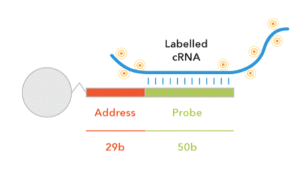
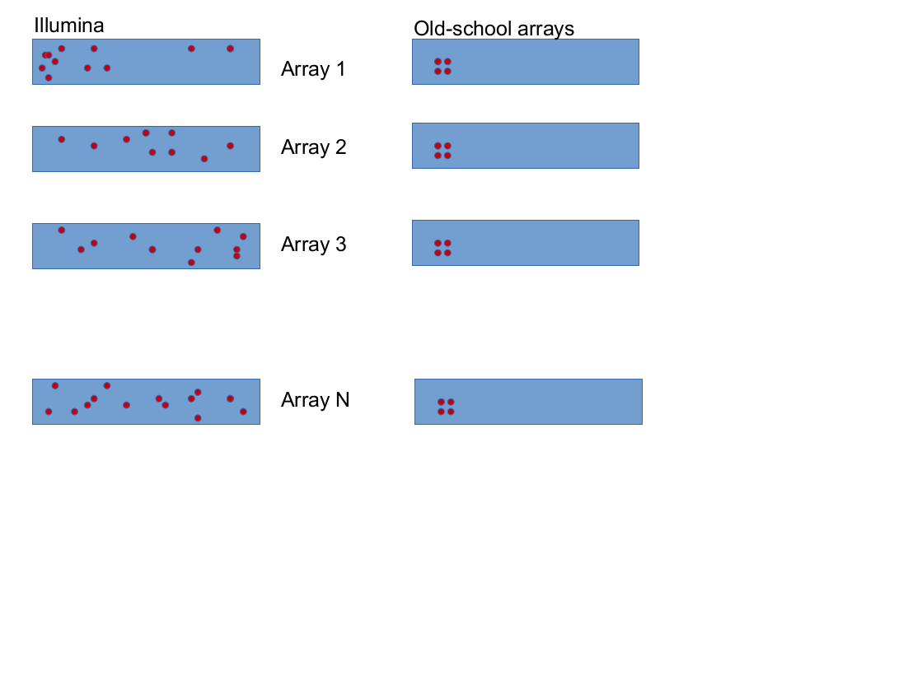
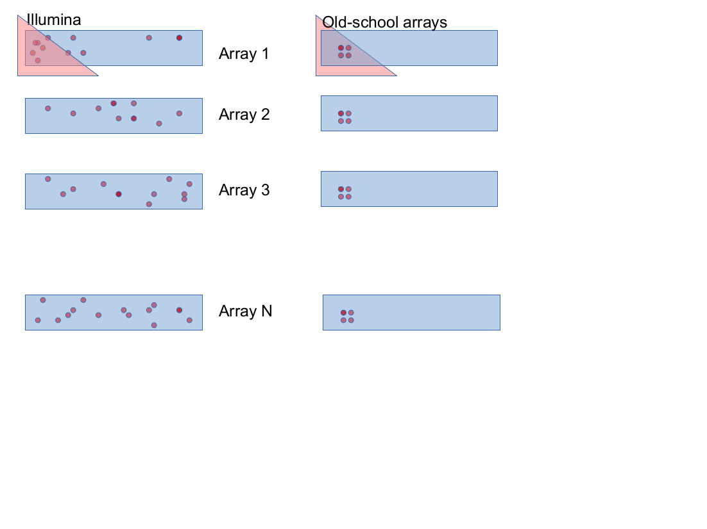
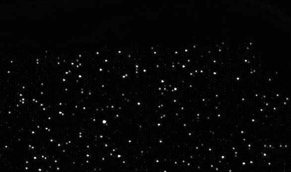
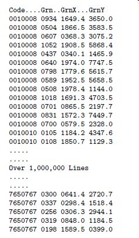
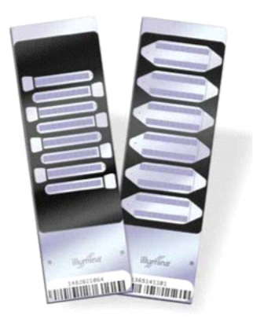

```{r echo=FALSE,message=FALSE}
library(beadarray)
```


# Illumina

Single-channel microarrays  
+ 50 base-pair 'probes' with the same sequence are attached to a bead 
+ Beads that have the same probe sequence are known as a *bead-type*
+ Beads are identified by Illumina using a decoding sequence



Randomly-arranged arrays

+ Arrays of randomly-arranged beads are constructed
+ The number of replicates of each bead-type follows a normal distribution
+ Around 20 replicates on most-recent arrays


Example Arrangement
Observations for Gene X on Illumina and older array technologies



Example
Consider a technical failure on one of the arrays



Output formats

TIFF image representation of the array surface




A text description of the bead locations, unique to each array. 



Know as *bead-level* data.

## Workflow
The analyst may have a choice over what data to take as a starting point

+ Raw images
+ Bead-level data - vary number of observations for a bead-type on each array and pre-computed intensities
+ Bead-summary - One value for each bead-type on each array. i.e. an 'Expression Matrix'
+ Starting with raw, or bead-level data gives more flexiblity in analysis
+ Bead-summary data fit in with standard Bioconductor tools

[http://tinyurl.com/omdru97](Ritchie et al)

(adapted from Ritchie et al)


```{r cache=TRUE}
library(beadarray)

chipPath <- system.file("extdata/Chips",package="BeadArrayUseCases")
list.files(chipPath)
sampleSheetFile <- paste0(chipPath,"/sampleSheet.csv")
data <- readIllumina(dir=chipPath,sampleSheet=sampleSheetFile,illuminaAnnotation="Humanv3")
```


+ 'Refseq' chips with 24,000 bead-types per array, 8 arrays per chip
+  WG- chips with 48,000 bead-types per array, 6 arrays per chip
+ HT-12 chips with 48,000 bead-types per array, 12 arrays per chip
+ Each chip also has an annotation 'version' (v1, v2, v3, v4)



Just like with Affy data, we can visualise the raw images.

```{r cache=TRUE}
imageplot(data, array=6,high="darkgreen",low="lightgreen",zlim=c(4,10))
```


```{r cache=TRUE}
imageplot(data, array=8,high="darkgreen",low="lightgreen",zlim=c(4,10))
```


We could use ***BASH*** which we don't cover today

Now we can summarise the data into a more-usable form

* outlier calculation?*

```{r cache=TRUE,echo=FALSE}
eset.ill <- summarize(data)
```

```{r}
eset.ill
```


The object should seem familiar from the previous section on Affymetrix

```{r}
head(exprs(eset.ill))
head(pData(eset.ill))
```

Examine the boxplot. Do the arrays seem normalised?

```{r}
boxplot(exprs(eset.ill),outline=FALSE)
```

We can normalise using `normaliseIllumina`

```{r}
eset.norm <- normaliseIllumina(eset.ill[,c(1:6,9:12)])
```

## Alternative data import

(from limma users guide)