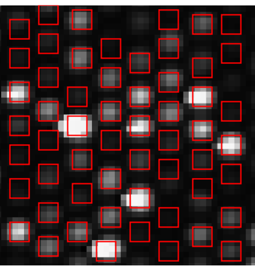
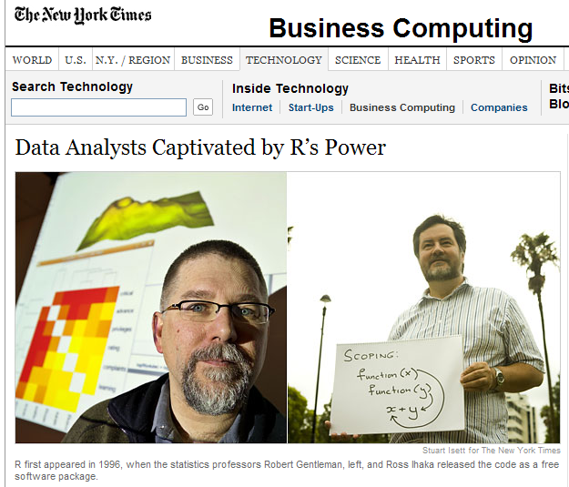
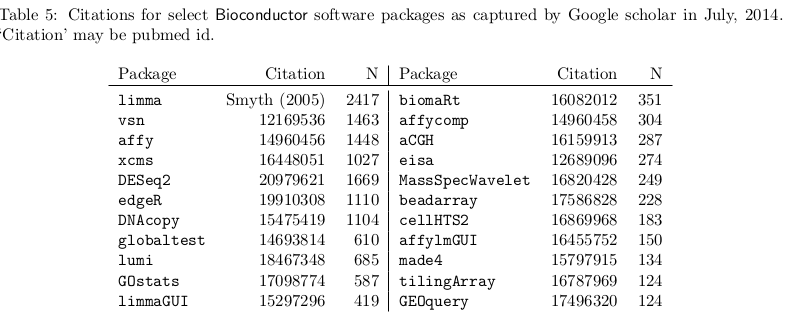

#Historical overview

## Probe and target

A microarray (sometimes referred to as an array) is a device for simultane-
ously measuring the expression level of thousands of genes. The technology
makes use of the base-complementarity property of DNA and the fact that
single-stranded mRNA is produced in order for a particular gene to be ex-
pressed. Thus, by measuring the amount of mRNA we can infer the expres-
sion level of the gene.

Microarrays are typically constructed by attaching single-stranded DNA
sequences, known as probes, to a surface such as a glass slide. Each probe is
complementary to the DNA sequence of a particular gene of interest and is
placed in spots (or features) at pre-defined locations. Single-stranded mRNA
from a sample of interest (called the target) is isolated, converted into single-
stranded DNA (cDNA) and then transcribed into cRNA. These cRNA are
then fluorescently labelled, and exposed to the microarray surface. The tar-
get RNA then binds (hybridises) to its complementary probe sequence on the microarray, whereas non-complementary sequences should fail to hybridise.
The amount of fluorescence observed at each feature can therefore be used
to determine the level of expression for each of the genes represented on the
array. In the earliest microarrays (Schena et al., 1995), each feature on
the array corresponded to a different gene of interest. However, subsequent
developments in microarray production have allowed the same gene to be rep-
resented multiple times, thus providing more reliable expression estimates.
Two-colour microarrays are used to compare two samples (e.g. cancer
and normal cells) on the same microarray. The RNA from the two samples
is extracted separately and fluorescently labelled with different dyes, usually
red and green. Therefore, after hybridisation, each feature is a mixture of
red and green fluorescence. A completely red or green feature indicates that
a particular gene is expressed in one sample, but not the other. In practice,
the mixture of red and green observed at each feature is not so clear-cut and
statistical methods are required to quantify the contribution of each colour,
as described later. A “differential expression” analysis aims to find genes that
have significantly different expression levels between different conditions un-
der investigation. Such genes are said to be differentially expressed (DE). See
Figure 1.1 for an illustration of a typical two-colour microarray experiment.
Microarrays have become an invaluable tool for medical research (Alli-
son et al., 2006) and provide a wealth of data that was previously unob-
tainable. The production of microarrays is a rapidly growing industry, with
many companies supplying variations of the technology for a wide range of
applications. Each company has a different method of manufacturing mi-
croarrays, the major differences being the production of the probe sequences
used and the method of depositing these sequences onto the array surface.
For instance, different length probe sequences (usually measured in the num-
ber of base-pairs) can be used as well as mRNA or cDNA probes, rather than
the cRNA probes described above.


Single-channel microrrays can also be produced to measure the absolute
expression level of every gene of interest in a given sample. Therefore, the
fluorescence of each feature is a measure of the expression level of a particu-
lar gene. Until recently, arguably the most popular single-channel microarray
technology was that of Affymetrix (Lockhart et al., 1996). These arrays use 25 base-pair probes that are synthesised on the array surface. Each gene of interest is interrogated by a collection of 11-20 probe pairs, known as a
probe set. The expression level for a gene is then derived by combining all
measurements from a particular probe set.


## Typical workflow

### Image Processing

A microarray surface is typically scanned by a laser to produce an image
representation of the fluorescence emitted by it. Thus, depending on the
resolution of the scanner, each feature will be represented by a number of
pixels. These are known as the raw images and are usually in the 16-bit
TIFF image format. Therefore, the intensity of each pixel is a value in the
range 0 to 2^16 − 1. 


```{r echo=FALSE,message=FALSE,fig.align='left',fig.cap="A high-resolution TIFF image is the result of scanning the array surface"}
library(affy)
targetsFile <- "estrogen/estrogen.txt"
pd <- read.AnnotatedDataFrame(targetsFile,header=TRUE,sep="",row.names=1)

raw <-ReadAffy(celfile.path = "estrogen", filenames=rownames(pData(pd))[1],phenoData = pd[1,])
image(raw,main="")
```

These images are usually processed by the manufacturers' software, which involves locating all the features on the image and then
calculating foreground intensities using the pixels that make up each feature. However, the pixel intensities measured on the image may be influenced by
factors other than hybridisation, such as optical noise from the scanner or
foreign items deposited on the array. Therefore, a background intensity is
estimated for each feature to account for such factors. The background and
foreground estimates generally act as a starting point for statistical analysis.



### Data processing
The intensities of the features on a microarray are influenced by many sources of noise and repeated measurements made on different microarrays may also appear to dis-
agree. Therefore, a number of data-cleaning, or pre-processing steps, must
take place before being able to draw valid biological conclusions from a mi-
croarray experiment (Quackenbush, 2002; Smyth et al., 2003; Allison
et al., 2006)

- Background correction
- Quality assessment
    + Some arrays might be dodgy or be from poor-quality samples
    + Systematic effects may emerge over time

##Microarrays vs sequencing

- Probe design issues
- Limited number of novel findings
- Genome coverage


##Are arrays still relevant?

- Wealth of data available online e.g. on [G.E.O](http://www.ncbi.nlm.nih.gov/geo/query/acc.cgi?acc=GPL10558)
- Useful as a validation platform
- Methods are established and well-understood
- Cheaper? And easier access to equipment


The "death" of microarrays was predicted as early as [2008](http://www.nature.com/news/2008/081015/full/455847a.html). In reality, it took quite a lot longer for arrays to be come obsolete. We have recently reached the [tipping point](http://core-genomics.blogspot.co.uk/2014/08/seqc-kills-microarrays-not-quite.html) where RNA-seq has taken over from gene expression arrays.

There is a vast amount of [Illumina](http://www.ncbi.nlm.nih.gov/geo/query/acc.cgi?acc=GPL10558) and [Affymetrix](http://www.ncbi.nlm.nih.gov/geo/query/acc.cgi?acc=GPL570) data out there waiting to be explored. Some studies often use these historical samples as validation of computational methods of cancer subtypes. e.g.  [here](http://jnci.oxfordjournals.org/content/107/1/dju357.abstract?cited-by=yes;107/1/dju357) or [here](http://www.genomebiology.com/2014/15/8/431)


### Many of the same issues apply to NGS data

- Experimental Design
- Quality assessment
    + NGS technologies
- Normalisation
- Statistical testing
- Clustering classification etc

Microarray data are much more manageable in size. We can work with decent-sized experiments (~100s of samples) and learn about high-dimensional analysis techniques


- Packages analyse all kinds of Genomic data (>800)
- Compulsory documentation (*vignettes*) for each package
- 6-month release cycle
- Course Materials
- Example data and workflows
- Common, re-usable framework and functionality
- Available Support

## Advantages of R



The R programming language is now recognised beyond the academic community as an effect solution for data analysis and visualisation. [Notable users of R](http://www.revolutionanalytics.com/companies-using-r) include [Facebook](http://blog.revolutionanalytics.com/2010/12/analysis-of-facebook-status-updates.html), [google](http://blog.revolutionanalytics.com/2009/05/google-using-r-to-analyze-effectiveness-of-tv-ads.html), [Microsoft](http://blog.revolutionanalytics.com/2014/05/microsoft-uses-r-for-xbox-matchmaking.html) (who recently [invested](http://blogs.microsoft.com/blog/2015/01/23/microsoft-acquire-revolution-analytics-help-customers-find-big-data-value-advanced-statistical-analysis/) in a commerical provider of R), and the [New York Times](http://blog.revolutionanalytics.com/2011/03/how-the-new-york-times-uses-r-for-data-visualization.html).

- Open-source
- Cross-platform
- Reproducibility
- Access to existing visualisation / statistical tools
- Flexibility
- Visualisation and interactivity


## Support for R

- Online forums
- Local user groups
- Documentation via `?` or `help.start()`

## RStudio


- Rstudio is a free environment for R
- Convenient menus to access scripts, display plots
- Still need to use *command-line* to get things done
- Developed by some of the leading R programmers

## R recap

R can do simple numerical calculations
```{r}
2  + 2
sqrt(25)
```

Here, `sqrt` is a *function* and the number 25 was used as an *argument* to the function. Functions can have multiple arguments

## variables

We can save the result of a computation as a *variable* using the *assignment* operator `<-`

```{r}
x <- sqrt(25)
x + 5
y <- x +5
y
```

## vectors

A vector can be used to combine multiple values. The resulting object is indexed and particular values can be queried using the `[]` operator

```{r}
vec <- c(1,2,3,6)
vec[1]
```

## vectors

Calculations can be performed on vectors

```{r}
vec*2
mean(vec)
sum(vec)
```

## Data frames

These can be used to represent familiar tabular (row and column) data

```{r}
df <- data.frame(A = c(1,2,3,6), B = c(7,8,10,12))
df
```

## Data frames

Don't need the same data *type* in each column

```{r}
df <- data.frame(A = c(1,2,3,6), 
                 B = month.name[c(7,8,10,12)])
df
```

##Data frame

We can subset data frames using the `[]`, but can specify row and column indices

```{r}
df[1,2]
df[2,1]
```

##Data frame

```{r}
df[1,]
df[,2]
```


Or leave the row or column index blank to get all rows and columns respectively

## The Bioconductor project


-  Packages analyse all kinds of Genomic data (>800)
- Compulsory documentation (*vignettes*) for each package
- 6-month release cycle
- Course Materials
- Example data and workflows
- Common, re-usable framework and functionality
- Available Support

## Example packages



##Downloading a package

Each package has its own landing page. e.g. http://bioconductor.org/packages/release/bioc/html/beadarray.html. Here you'll find;

- Installation script (will install all dependancies)
- Vignettes and manuals
- Details of package maintainer
- After downloading, you can load using the `library` function. e.g. `library(beadarray)`

##Reading data using Bioconductor

Recall that data can be read into R using `read.csv`, `read.delim`, `read.table` etc. Several packages provided special modifications of these to read raw data from different manufacturers

- `limma` for various two-colour platforms
- `affy` for Affymetrix data
- `beadarray`, `lumi`, `limma` for Illumina BeadArray data
- A common class is used to represent the data

##Reading data using Bioconductor

A dataset may be split into different components

- Matrix of expression values
- Sample information
- Annotation for the probes

In Bioconductor we will often put these data the same object for easy referencing. The `Biobase` package has all the code to do this.
