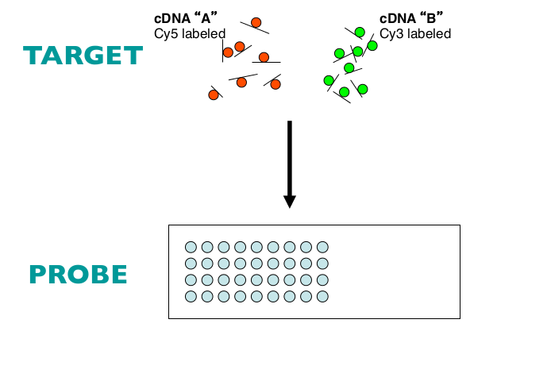
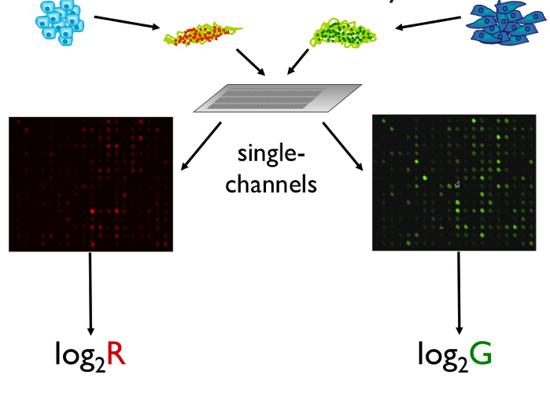
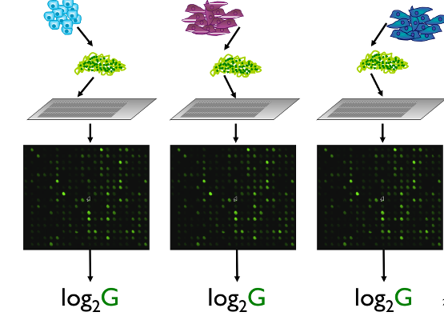
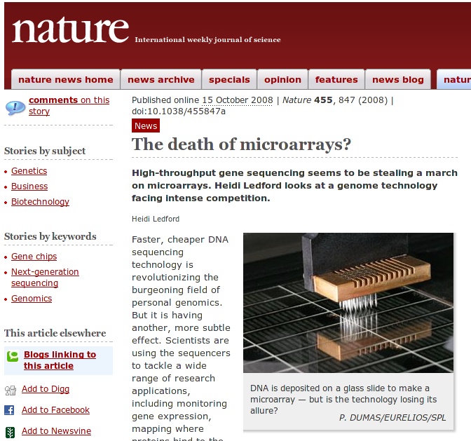
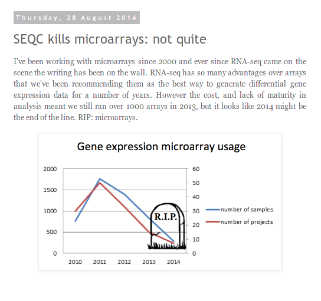
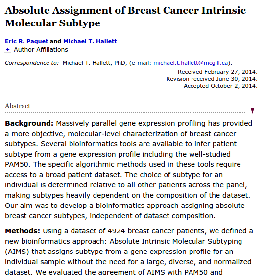
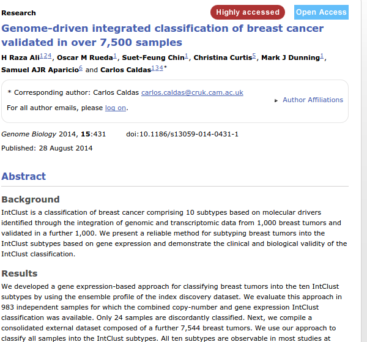
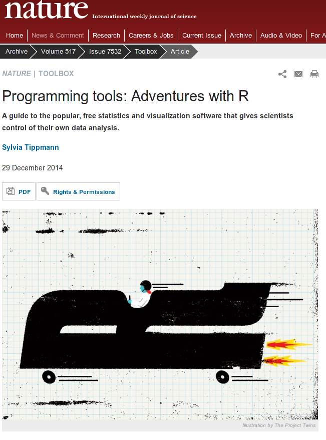

#Historical overview

## Probe and target



## Two-colour arrays



## Single-Channel



## Look at a 'modern' microarray


Around 48,000 genes per sample, 12 samples on a slide

##Microarrays vs sequencing

- Probe design issues
- Limited number of novel findings
- Genome coverage


##Are arrays still relevant?

- Wealth of data available online e.g. on >>[G.E.O](http://www.ncbi.nlm.nih.gov/geo/query/acc.cgi?acc=GPL10558)<<
- Useful as a validation platform
- Methods are established and well-understood
- Cheaper? And easier access to equipment
- Some of the lessons learnt from microarray analysis can be applied to sequencing data
- Useful introduction to the world of Bioconductor

##Are arrays still relevant?



##Are arrays still relevant?
http://core-genomics.blogspot.co.uk/2014/08/seqc-kills-microarrays-not-quite.html




##Are arrays still relevant?



##Are arrays still relevant?



## Conclusion


# The Bioconductor project


-  Packages analyse all kinds of Genomic data (>800)
- Compulsory documentation (*vignettes*) for each package
- 6-month release cycle
- Course Materials
- Example data and workflows
- Common, re-usable framework and functionality
- Available Support

## Advantages of R

- Open-source
- Cross-platform
- Reproducibility
- Access to existing visualisation / statistical tools
- Flexibility
- Visualisation and interactivity

## Recent Press


## Recent Press



## Support for R

- Online forums
- Local user groups
- Documentation via `?` or `help.start()`

## RStudio


- Rstudio is a free environment for R
- Convenient menus to access scripts, display plots
- Still need to use *command-line* to get things done
- Developed by some of the leading R programmers

## R recap

R can do simple numerical calculations
```{r}
2  + 2
sqrt(25)
```

Here, `sqrt` is a *function* and the number 25 was used as an *argument* to the function. Functions can have multiple arguments

## variables

We can save the result of a computation as a *variable* using the *assignment* operator `<-`

```{r}
x <- sqrt(25)
x + 5
y <- x +5
y
```

## vectors

A vector can be used to combine multiple values. The resulting object is indexed and particular values can be queried using the `[]` operator

```{r}
vec <- c(1,2,3,6)
vec[1]
```

## vectors

Calculations can be performed on vectors

```{r}
vec*2
mean(vec)
sum(vec)
```

## Data frames

These can be used to represent familiar tabular (row and column) data

```{r}
df <- data.frame(A = c(1,2,3,6), B = c(7,8,10,12))
df
```

## Data frames

Don't need the same data *type* in each column

```{r}
df <- data.frame(A = c(1,2,3,6), 
                 B = month.name[c(7,8,10,12)])
df
```

##Data frame

We can subset data frames using the `[]`, but can specify row and column indices

```{r}
df[1,2]
df[2,1]
```

##Data frame

```{r}
df[1,]
df[,2]
```


Or leave the row or column index blank to get all rows and columns respectively

## The Bioconductor project


-  Packages analyse all kinds of Genomic data (>800)
- Compulsory documentation (*vignettes*) for each package
- 6-month release cycle
- Course Materials
- Example data and workflows
- Common, re-usable framework and functionality
- Available Support

## Example packages


##Downloading a package

Each package has its own landing page. e.g. http://bioconductor.org/packages/release/bioc/html/beadarray.html. Here you'll find;

- Installation script (will install all dependancies)
- Vignettes and manuals
- Details of package maintainer
- After downloading, you can load using the `library` function. e.g. `library(beadarray)`

##Reading data using Bioconductor

Recall that data can be read into R using `read.csv`, `read.delim`, `read.table` etc. Several packages provided special modifications of these to read raw data from different manufacturers

- `limma` for various two-colour platforms
- `affy` for Affymetrix data
- `beadarray`, `lumi`, `limma` for Illumina BeadArray data
- A common class is used to represent the data

##Reading data using Bioconductor

A dataset may be split into different components

- Matrix of expression values
- Sample information
- Annotation for the probes

In Bioconductor we will often put these data the same object for easy referencing. The `Biobase` package has all the code to do this.
