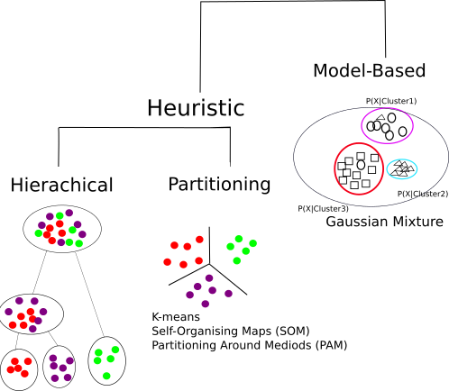

# Clustering (and PCA)


## Clustering.. or Classification?

- **Unsupervised:** classes unknown, want to discover them from the data (cluster analysis)
- **Supervised:** classes are predefined, want to use a (training or learning) set of labelled objects to form a classifier for classification of future observations


## Why do clustering for genomic data?

- Clustering leads to readily interpretable figures and can be helpful for identifying patterns in time or space.
- We can cluster samples (columns)
    + e.g. identification of new / unknown tumor classes using gene expression profiles
- We can cluster genes (rows)
    + e.g. using large numbers of yeast experiments to identify groups of co-regulated genes
    + we can cluster genes to reduce redundancy (i.e. variable selection) in predictive models
    
### Subtype Discovery    
- There are plenty of examples of using clustering to discover subtypes in the literature


### Clustering as QA

- Also used as a quality assessment tool
    + to check for outlier samples


- Can check within / between experiment variability and potential confounding factors (batch effect etc)
    
    


### Clustering Overview

- Steps in a Cluster Analysis
    1. Preprocess the data
    2. Choose a *dissimilarity* measure
    3. Choose a cluster algorithm
    4. Select the number of clusters
    5. Validate the procedure
    

When clustering genes, it is common to pre-process;

- normalise
- filter; remove genes with low variability across samples and many missing values
- (impute missing values)
- standardise; e.g. zero-mean and, unit variance:
    + $y_g^* = (y_g - \mu_g)/\sigma_g$
    
### How to compute similarity
Common *Similarity* / *Dissimilarity* measures include

- Correlation coefficient; *scale invariant*
    + Pearson's correlation;
    + Spearman correlation of ranks
    
- Distance: scale dependant
    + Euclidean distance; $d(x,y) = \sqrt{\sum_i (x_i - y_i)^2}$
    + City block (Manhattan) distance; $d(x,y) = \sum | x_i - y_i |$
    + and others.....

- ***Warning***: Don't get too hung-up on the choice of measure
    + Clustering is primarily an exploratory tool
    + If your data has signal, it should show regardless of which measure you choose
    + Don't just pick the one which "looks the best"
    
### How to compute similarity, in R

The `dist` function can be used to calculate a variety of similarity measures

- As usual, we can do `?dist`. 
- The input is a matrix of numerical values
- Let's test with some sample data

```{r echo=FALSE}
set.seed(10032016)
```


```{r}
myMatrix <- matrix(rnorm(1000),ncol=10)
colnames(myMatrix) <- LETTERS[1:10]
head(myMatrix)
```


- The default is to compute distances from the *rows* of the matrix
    + i.e. which would normally be the genes we are measuring
- Also note that the matrix has some values that appear to be missing
    + why do you think that might be?

```{r eval=FALSE}
d <- dist(myMatrix)
d
```


- The more common use of clustering is to cluster the columns (*samples*)
- To do this, we have to *transpose* the matrix; using the function `t`

```{r}
d <- dist(t(myMatrix))
d
```


- Changing the type of distance measure can be done by changing the `method` argument

```{r}
d.man <- dist(t(myMatrix),method="manhattan")
d.man
```

### How to calculate correlation in R

- This time we use the `cor` function (`?cor`)
- What do you notice about the output, compared to that of `dist`?

```{r}
cor(myMatrix)
```

- Clustering algorithms will expect input in distance matrix form
- We can convert using `as.dist`

```{r}
corMat <- as.dist(cor(myMatrix))
corMat
```

- Two samples with a *higher correlation* values means *more similar*
- ...so the *distance* between is *less*


```{r}
corMat <- as.dist(1-abs(cor(myMatrix)))
corMat
```


### Correlation versus Distance

- A simple toy example of three genes
    + which genes seem to be closest?


- Using Euclidean distance

```{r echo=FALSE}
gene2 <- c(-1, -0.5, 0.3, -0.4,0.7,0.9, 1.1,0.8,1.5,1.3)
gene1 <- gene2+2
gene3 <- gene1 + runif(10,min = -0.4,0.4)

geneMatrix <- rbind(gene1,gene2,gene3)
dist(geneMatrix)
```

- Correlation matrix

```{r echo=FALSE}
cor(t(geneMatrix))
par(mfrow=c(1,2))
plot(hclust(dist(geneMatrix)),main="Distance = Euclidean")
plot(hclust(as.dist(1-cor(t(geneMatrix)))),main="Distance = Correlation")

```


    
### Choice of algorithm    
    
Clustering Algorithms



## Hierachical methods

- start with *n* samples (or $p$ gene) clusters
- At each step, *merge* the two closest clusters using a measure of *between-cluster* dissimilarity which reflects the shape of the clusters
- The distance between the clusters is defined by the method used (e.g. in *complete linkage*, the distance is defined as the distance between the furthest pair of points in the two clusters)


- Dendrograms are good visual guides, but *arbitrary*
- Nodes can be reordered
    + Closer on dendrogram $\ne$ more similar


### Performing hierachical clustering, in R

- The function to use here is `hclust` (`?hclust`)
- It takes a distance matrix that you computed previously

```{r}
clust <- hclust(d)
clust
```


- The standard plotting function has been extended to visualise the result of the clustering

```{r}
plot(clust)
```


- We can change the name of the method


```{r}
clust.ward <- hclust(d,method = "ward.D")
par(mfrow=c(1,2))
plot(clust)
plot(clust.ward)
```


- Two useful functions are `cutree` and `rect.hclust`
- Can be used to "cut" the dendrogram at a particular height

```{r}
par(mfrow=c(1,1))
plot(clust)
cutree(clust, h=16)
rect.hclust(clust, h=16)
```


- Alternatively, we can see the number of clusters; *k*
- Try experimenting with different values of k....

```{r}
plot(clust)
cutree(clust, k=2)
rect.hclust(clust, k=2)
```


### What is the optimal number of clusters?

- A measure called the ***silhouette width*** can be computed.
- The silhouette measures how well-matched an object is to others in it's own cluster, versus how well-matched it would be if it were moved to the next closest cluster
- Value around 0 -> a gene lies between two clusters
- Value of -1 -> gene is similar to element in neighbour cluster and probably in the wrong cluster
- Value of around 1 -> good clustering
- Output from `silhouette` function for the gene expression example earlier

```{r echo=FALSE}
library(cluster)
d <- dist(t(exprs(data.noout)))
par(mfrow=c(1,2))
pr <- pam(d, 2)
si4 <- silhouette(pr)
par(mfrow=c(1,2))
plot(hclust(d))
rect.hclust(hclust(d),k=2)
plot(si4, col = c("red", "blue"),main="")# with cluster-wise coloring

```

    
    
## Summary of clustering

- Useful as ***exploratory / visualisation*** tools
- Choice of metric, methods and parameters usually guided by prior knowledge about the question
    + The result is guided by what you are looking for
- Validate using different algorithms
- Use prior Biological knowledge, or your sample meta data to see if the clusters make sense
- Be aware
    + Clustering will always produce something. It cannot NOT work
- Clustering is a generic technique that can be applied to many forms of data
    + We will use it on Microarrays, but it can be used on RNA-seq, ChIP, or other NGS data
- Quality assessment of samples
      + checking for batch effects and outliers
      + check effectiveness of normalisation / transformation

# Principal Components Analysis (PCA)

## Why Use PCA

- In genomic data, we have a large number of variables which are often highly correlated

- PCA is one of many *dimension-reduction* techniques that can remove redundancy and give a smaller more mangeable set of variables. In summary it can help us to:-

- Reduce *dimensionality* of the data
- Decrease the *redundancy* of the data
- Filter the *noise* in the data
- *Compress* the data


## PCA Example: Whisky

The data: 86 malt whiskies scored for 12 different taste categories

(https://www.mathstat.strath.ac.uk/outreach/nessie/nessie_whisky.html)

- Q. Can we find which whiskies have a similar taste profile?
- Q. What are the factors that determine the taste profile?

```{r echo=FALSE}
download.file("https://www.mathstat.strath.ac.uk/outreach/nessie/datasets/whiskies.txt",destfile = "whiskies.txt")
whisky <- read.csv("whiskies.txt")
scores <- whisky[,c(3:14)]
rownames(scores) <- whisky$Distillery
head(scores,n=3)
```


## More-relevant example

- MAQC microarrays with mixtures of Brain and Reference RNA (UHRR) at different concentrations
- Run in different labs
    + what do you notice?


## More-relevant example

So, PCA can be used as a quality assessment tool and can inform us of any factors we need to account for in the analysis

- In this case we could correct for the batch effect, or add a batch factor to the linear model for analysis


## What is going-on here?

A two-dimensional case

- Find direction of most variation (PC1)
- Direction that explains next amount of variation is orthogonal (at 90 degrees) (PC2)
- Each point on original x and y is a linear combination of PC1 and PC2
- Higher dimensional data can have many more components PC3, PC4....
    + although they will become increasingly less-influential


## Worked example

Getting the data...

```{r}
whisky <- read.csv("https://www.mathstat.strath.ac.uk/outreach/nessie/datasets/whiskies.txt")
scores <- whisky[,c(3:14)]
rownames(scores) <- whisky$Distillery
head(scores,n=3)
```

## Running the PCA

The `prcomp` function does the hard-work for us

- It is computing *eigenvectors* and *eigenvalues* from our input matrix
    + or rather the covariance matrix
- We have 12 components (as we had 12 variables)
- The components are ordered according to the amount of variance they *explain*

```{r}
pca <- prcomp(scores)
summary(pca)
```

## Dissecting the PCA results

- Each column in a principal component
    + in decreasing order of importance
- The values are the measure of importance for each component
    + e.g. Smoky seems to be important for PC1
    + Smoky and Floral are opposite ends of the spectrum for PC1
    
```{r}
pca$rotation[,1:5]
```

## How many components?

We look at the variance explained by each component and judge where it "drops-off"

- Sometimes called a "scree-plot"
```{r}
plot(pca)
```

## How many components?


## Dissecting the PCA results

The new co-ordinate system is given by `pca$x`

- One row for each of our whiskies, one column for each component
- The original coordinates are a linear combination of the new ones
    + an exercise for the reader?

```{r}
pca$x[1:3,1:5]
```

## Dissecting the PCA results

`ggplot2` is especially convenient for visualising the results

- An overlay of the known variables will highlight the patterns
- As with clustering, PCA is to be used as an exploratory tool

```{r}
df <- data.frame(whisky,pca$x)
ggplot(df, aes(x=PC1,y=PC2,label=Distillery,cex=Smoky,col=as.factor(Floral))) + geom_point() + geom_text(cex=5,alpha=0.3)
```
